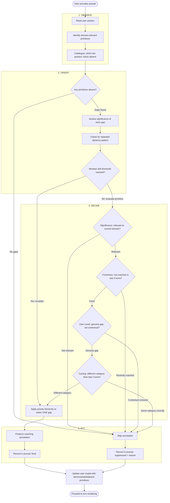
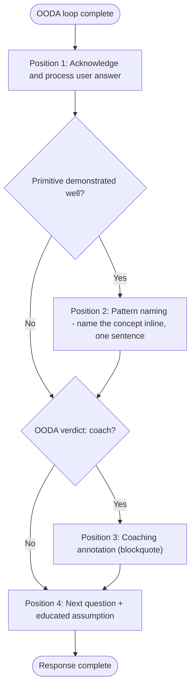

# Process Flow Diagrams: Adaptive Coaching Annotations

## Summary

Two process flows govern the coaching system's behaviour: the OODA decision loop
(executed on every user answer) and the turn structure (the ordering of elements
in each agent response).

---

### PF-01: OODA Coaching Decision Loop

**Related Use Case:** UC-01
**Trigger:** User provides an answer to a facilitation question
**End State:** Agent has either produced a coaching annotation or decided to skip, and has updated the user model

#### Process Steps

| Step | Description | Actor/System | Inputs | Outputs | Business Rules |
|------|-------------|-------------|--------|---------|----------------|
| O1 | Read user's answer | Agent | Raw user text | Parsed content | -- |
| O2 | Identify which primitives apply to current domain | Agent | Current exploration domain, FR-04 mapping | Relevant primitive set (subset of S1-S7, A1-A7) | BR-04 |
| O3 | Check each relevant primitive against the answer | Agent | Answer content, relevant primitives | Present/absent classification per primitive | -- |
| OR1 | Determine if any relevant primitives are absent | Agent | Present/absent classifications | Binary: gaps exist or not | -- |
| OR2 | Assess significance of each absent primitive | Agent | Absent primitives, conversation history | Significance score per gap | -- |
| OR3 | Check if this primitive has been absent before | Agent | Journal history, current absent primitives | Repeated absence flag | -- |
| OR4 | Check mindset skill thresholds | Agent | Repeated absence counts, mindset trigger map | Mindset escalation flag | BR-08 |
| D1-D4 | Apply four Decide criteria | Agent | Gap data, journal history, user model | Coach or skip verdict | BR-05, BR-13 |
| D5 | Select highest-priority gap | Agent | All qualifying gaps | Single gap selection | BR-01, BR-03 |
| A1 | Render annotation | Agent | Selected gap, user's answer context | Blockquote annotation text | BR-02, BR-14 |
| A2/A4 | Record in journal | Agent | Decision outcome | Journal entry | BR-11, BR-12 |

#### Decision Points

| Decision | Criteria | Yes Path | No Path |
|----------|----------|----------|---------|
| Any primitives absent? | At least one domain-relevant primitive not demonstrated in answer | Proceed to significance assessment | Skip annotation |
| Mindset skill threshold? | 3+ absences of primitives associated with a mindset skill | Escalate to mindset skill coaching | Evaluate individual primitive |
| Significance? | Gap is relevant to the current exploration domain | Continue evaluation | Skip annotation |
| Freshness? | This primitive has not been coached in the last 3 turns | Continue evaluation | Skip annotation |
| User Level? | User model indicates this is a genuine gap, not contextual | Continue evaluation | Skip annotation |
| Cycling? | The annotation category (structural/analytical/mindset) differs from last 2 turns | Select gap and coach | Skip annotation |

---

### PF-02: Agent Turn Structure

**Related Use Case:** UC-01
**Trigger:** OODA loop completes; agent is ready to render response
**End State:** Agent has produced a well-ordered response with facilitation content and optional coaching

#### Process Steps

| Step | Description | Actor/System | Inputs | Outputs | Business Rules |
|------|-------------|-------------|--------|---------|----------------|
| P1 | Acknowledge user's answer, process content | Agent | User answer, conversation history | Response text (acknowledgement) | -- |
| P2 | Check if user demonstrated a primitive worth naming | Agent | OODA Observe results | Pattern naming decision | BR-15 |
| P2Y | Produce pattern naming phrase | Agent | Demonstrated primitive | Inline text naming the concept | One sentence max |
| P3 | Check OODA verdict | Agent | OODA Act output | Coach or skip | BR-01, BR-13 |
| P3Y | Insert coaching annotation | Agent | Selected gap, annotation text | Blockquote annotation | BR-02, BR-14 |
| P4 | Produce next facilitation question with educated assumption | Agent | Exploration plan, conversation context | Question + inference | -- |

#### Ordering Constraints

| Constraint | Rule | Rationale |
|-----------|------|-----------|
| Annotation before question | Position 3 always precedes position 4 | Annotation references previous answer; question targets next topic |
| Pattern naming before annotation | Position 2 always precedes position 3 | Celebrate what was right before addressing what was missing |
| Reflection suppression | At reflection checkpoints, positions 2 and 3 are replaced by the reflection summary | Reflection and coaching serve conflicting cognitive functions |
