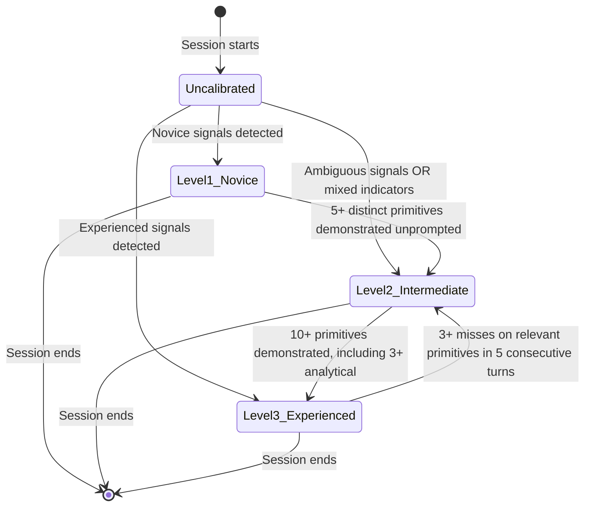

# State Diagrams: Adaptive Coaching Annotations

## Summary

The user model is the primary stateful entity in the coaching system. It tracks the
agent's evolving understanding of the user's SA&D experience level and determines
coaching behaviour throughout the session.

---

### ST-01: User Model Lifecycle

**Entity:** User Model
**Related Use Cases:** UC-02, UC-01, UC-03
**Purpose:** The user model's current state determines coaching frequency, annotation
suppression thresholds, and whether mindset skills are coached. Every OODA cycle reads
and writes the user model.

#### States

| State | Description | Entry Conditions | Coaching Behaviour |
|-------|-------------|-----------------|-------------------|
| Uncalibrated | No user model exists. Session has just started. | Session start | No coaching -- agent is in Phase 1 orientation |
| Level 1: Novice | User shows little SA&D experience. Uses informal language, describes features not flows, no scope awareness. | Novice signals during Phase 1; or default when no prior session context | Annotations active from first facilitation turn. Pattern naming includes brief explanations. Normal frequency. |
| Level 2: Intermediate | User shows some SA&D experience. May use some terminology, demonstrates some primitives but not consistently. | Ambiguous signals during Phase 1; or promotion from Level 1 after 5+ demonstrations; or demotion from Level 3 | Annotations active but frequency reduced. Pattern naming without explanation unless concept is new to conversation. |
| Level 3: Experienced | User demonstrates strong SA&D competency. Uses terminology fluently, frames in terms of actors/flows/constraints, distinguishes scope. | Strong experienced signals during Phase 1; or promotion from Level 2 after 10+ demonstrations | Annotations suppressed by default. Only fire for genuinely surprising gaps -- primitives absent across 5+ relevant opportunities. Pattern naming only for unusual concepts. |

#### Transitions

| From | To | Trigger | Guard Conditions | Side Effects |
|------|----|---------|-----------------|--------------|
| Uncalibrated | Level 1 | Phase 1 orientation complete | Novice indicators: informal vocabulary, feature-list framing, no scope distinction | Coaching behaviour set to active/normal |
| Uncalibrated | Level 2 | Phase 1 orientation complete | Mixed indicators: some SA&D vocabulary but inconsistent; or signals genuinely ambiguous | Coaching behaviour set to active/reduced. Agent monitors closely for 3 turns. |
| Uncalibrated | Level 3 | Phase 1 orientation complete | Strong indicators: SA&D terminology, flow-based framing, scope awareness | Coaching behaviour set to suppressed. Agent communicates calibration: "I'll focus on the specification rather than the methodology." |
| Level 1 | Level 2 | User model update after OODA cycle | 5+ distinct primitives (from S1-S7, A1-A7) demonstrated unprompted across the session | Coaching frequency decreases. Agent does not announce the transition. |
| Level 2 | Level 3 | User model update after OODA cycle | 10+ distinct primitives demonstrated unprompted, including at least 3 analytical primitives (A1-A7) | Coaching suppressed. Agent does not announce the transition. |
| Level 3 | Level 2 | User model update after OODA cycle | 3+ misses on domain-relevant primitives within 5 consecutive turns | Coaching reactivated at reduced frequency. Agent does not announce the demotion. |

#### Invalid Transitions

| From | To | Why Invalid |
|------|----|------------|
| Level 1 | Level 3 | Cannot skip Level 2. Progressive demonstration required. |
| Level 3 | Level 1 | Demotion goes one level at a time. Severe regression defaults to Level 2. |
| Any calibrated state | Uncalibrated | Once calibrated, the model is never reset within a session. |
