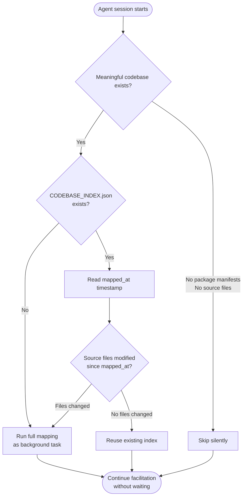
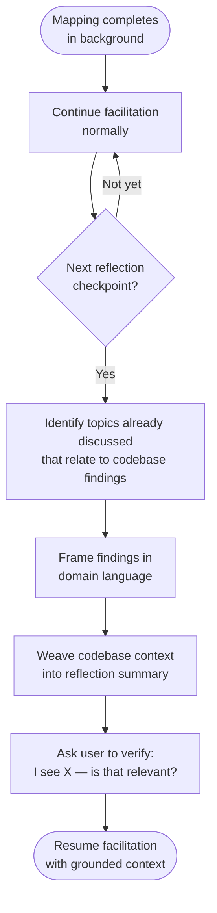

# Process Flows: Auto Codebase Mapping

## PF-01: Session Start Mapping Decision

**Trigger:** Requirements-analyst agent begins a session
**End State:** Mapping running in background, skipped (stale check), or skipped (greenfield)

### Process Steps

| Step | Description | Actor/System | Inputs | Outputs |
|------|-------------|-------------|--------|---------|
| 1 | Check for package manifests and source files | Agent | Working directory | Greenfield or brownfield determination |
| 2 | Check for existing CODEBASE_INDEX.json | Agent | Specification folder | Index exists or not |
| 3 | Read mapped_at timestamp from existing index | Agent | CODEBASE_INDEX.json | ISO-8601 timestamp |
| 4 | Compare timestamp against source file mtimes | Agent | Timestamp, source file mtimes | Stale or current |
| 5 | Run full mapping as background task | Agent | Working directory | Background task handle |
| 6 | Continue facilitation without blocking | Agent | — | First facilitation question |

### Decision Points

| Decision | Criteria | Yes Path | No Path |
|----------|----------|----------|---------|
| Meaningful codebase exists? | At least one package manifest OR source file present | Check for existing index | Skip silently, proceed as greenfield |
| CODEBASE_INDEX.json exists? | File present in specification folder | Read timestamp, check staleness | Run full scan |
| Source files modified since mapped_at? | Any source file mtime > mapped_at (excluding ignored dirs) | Run full scan | Reuse existing index |

---

## PF-02: Codebase Context Overlay

**Trigger:** Background mapping task completes
**End State:** Codebase context woven into facilitation at reflection checkpoint

### Process Steps

| Step | Description | Actor/System | Inputs | Outputs |
|------|-------------|-------------|--------|---------|
| 1 | Mapping completes in background | System | Working directory | CODEBASE_INDEX.json |
| 2 | Continue facilitation until next reflection checkpoint | Agent | User responses | 3-4 exchanges of exploration |
| 3 | Identify overlap between discussed topics and codebase | Agent | Conversation context, index | Relevant codebase findings |
| 4 | Translate findings to domain language | Agent | Technical index data | Domain-focused descriptions |
| 5 | Weave context into reflection summary | Agent | Reflection + codebase context | Combined reflection |
| 6 | Verify with user | Agent | Hypothesis about relevance | User confirmation or correction |
