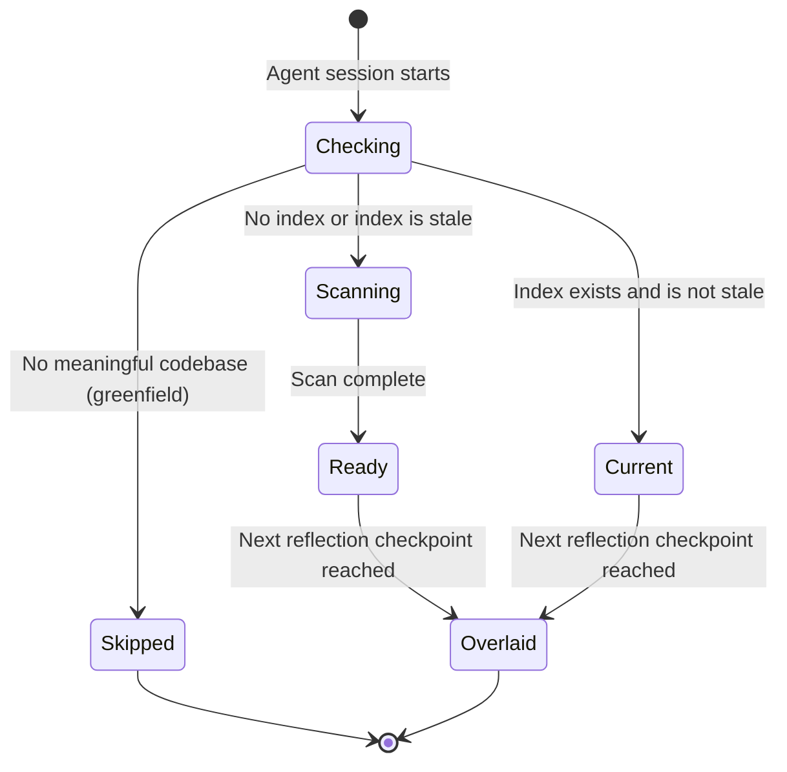

# State Diagrams: Auto Codebase Mapping

## ST-01: Mapping Task Lifecycle

**Entity:** Codebase mapping background task
**Purpose:** Tracks the state of the mapping task from session start through to context overlay

### States

| State | Description | Entry Conditions | Allowed Actions |
|-------|-------------|-----------------|-----------------|
| Checking | Evaluating whether mapping is needed | Agent session starts | Check for codebase, check for existing index, check staleness |
| Skipped | No mapping performed | No meaningful codebase detected | None — facilitation proceeds without index |
| Current | Existing index is still valid | Index exists and no source files modified since mapped_at | Wait for reflection checkpoint to overlay |
| Scanning | Full codebase scan in progress | No index exists, or index is stale | Run in background, do not block facilitation |
| Ready | Scan complete, waiting for overlay opportunity | Background scan finishes | Wait for next reflection checkpoint |
| Overlaid | Codebase context has been introduced to the conversation | Reflection checkpoint reached with index available | Deep dives available on-demand |

### Transitions

| From | To | Trigger | Guard Conditions | Side Effects |
|------|-----|---------|-----------------|--------------|
| [*] | Checking | Agent session starts | — | — |
| Checking | Skipped | Greenfield detected | No package manifests AND no source files | — |
| Checking | Current | Staleness check passes | Index exists AND no files modified since mapped_at | — |
| Checking | Scanning | Scan needed | No index OR stale index | Background task launched |
| Scanning | Ready | Scan complete | — | CODEBASE_INDEX.json written |
| Ready | Overlaid | Reflection checkpoint | Agent has findings relevant to discussed topics | Context woven into reflection |
| Current | Overlaid | Reflection checkpoint | Agent has findings relevant to discussed topics | Context woven into reflection |

### Invalid Transitions

| From | To | Why Invalid |
|------|----|-------------|
| Checking | Overlaid | Cannot overlay without first determining index availability |
| Scanning | Overlaid | Cannot overlay while scan is still in progress — must wait for Ready |
| Skipped | Overlaid | No index exists to overlay |
| Skipped | Scanning | Greenfield projects do not get scanned |
