# Data Flow Diagrams: Primitive Tree Architecture

**Version:** 1.0.0
**Date:** 2026-03-16

---

## Summary

Two data flow diagrams capture how information moves through the primitive tree system:
the artifact pipeline (from codebase through tree to SRD artifacts) and the facilitation
loop (how user input flows through the tree to update specifications).

---

## DF-01: Artifact Pipeline

**Scope:** System-level
**Related Use Cases:** UC-01, UC-02, UC-07

This diagram shows the full data pipeline from raw inputs (codebase or user description)
through the tree to the final specification artifacts. The key architectural decision —
evidence/interpretation separation — is visible in the two-stage pipeline: CODEBASE_INDEX.json
captures facts, PRIMITIVE_TREE.jsonld captures the agent's structured interpretation.

```mermaid
flowchart LR
    subgraph Inputs
        Codebase[("Target Project Codebase")]
        UserDesc[("User Description")]
        LLM[("LLM Domain Knowledge")]
    end

    subgraph EvidenceLayer["Evidence Layer"]
        Mapper["Codebase Mapping Skill"]
        Index[("CODEBASE_INDEX.json")]
    end

    subgraph InterpretationLayer["Interpretation Layer"]
        Synth["Tree Synthesis Process"]
        Tree[("PRIMITIVE_TREE.jsonld")]
    end

    subgraph FacilitationLayer["Facilitation Layer"]
        OODA["OODA Spiral"]
        Conversation[("Facilitation Conversation")]
    end

    subgraph OutputLayer["Output Layer"]
        ArtifactGen["Artifact Generation"]
        SRD[("SRD.md")]
        Diagrams[("diagrams/")]
        NFR[("NFR.md")]
        Glossary[("GLOSSARY.md")]
        Handover[("HANDOVER.md")]
    end

    Codebase -->|"source files, manifests, configs"| Mapper
    Mapper -->|"flat inventory: services, models, integrations, routes"| Index
    Index -->|"evidence"| Synth
    UserDesc -->|"scope, domain, goals"| Synth
    LLM -->|"expected architecture for domain"| Synth
    Synth -->|"structured DAG: typed nodes, dependencies, phases"| Tree

    Tree -->|"gaps, priorities"| OODA
    OODA -->|"targeted questions"| Conversation
    Conversation -->|"user answers: specifications, confirmations, corrections"| Tree

    Tree -->|"structural completeness checklist"| ArtifactGen
    Conversation -->|"content: flows, rules, constraints, details"| ArtifactGen
    ArtifactGen -->|"behavioural specification"| SRD
    ArtifactGen -->|"visual models"| Diagrams
    ArtifactGen -->|"constraint targets"| NFR
    ArtifactGen -->|"domain terms"| Glossary
    ArtifactGen -->|"execution brief"| Handover
```

#### Data Stores

| ID | Name | Type | Contents | Access Pattern |
|----|------|------|----------|----------------|
| DS-01 | CODEBASE_INDEX.json | File (JSON) | Flat inventory: technology stack, services, data models, integrations, routes, patterns | Write-once per session (or on staleness), read by tree synthesis |
| DS-02 | PRIMITIVE_TREE.jsonld | File (JSON-LD) | Structured DAG: typed nodes with properties, typed dependency edges, health statuses, facilitation phases | Read-write throughout facilitation; read by artifact generation |
| DS-03 | Facilitation conversation | In-memory (conversation context) | All questions asked and answers received during facilitation | Append-only during facilitation; read by artifact generation |
| DS-04 | SRD artifacts | Files (Markdown) | SRD.md, diagrams/*.md, NFR.md, GLOSSARY.md, HANDOVER.md | Write during artifact generation; read by execution agent |

#### Data Flows

| ID | From | To | Data | Format | Frequency |
|----|------|----|------|--------|-----------|
| FL-01 | Codebase | Mapper | Source files, manifests, configs | Files on disk | Once per session |
| FL-02 | Mapper | Index | Services, models, integrations, routes, stack | JSON | Once per session |
| FL-03 | Index | Synthesis | Evidence: what exists in code | JSON | Once at tree creation |
| FL-04 | User | Synthesis | System description, scope, goals | Natural language | Once at tree creation (greenfield) |
| FL-05 | LLM | Synthesis | Expected architecture for recognized domain | Internal inference | Once at tree creation |
| FL-06 | Synthesis | Tree | Structured DAG | JSON-LD | Once at creation, then updated via FL-09 |
| FL-07 | Tree | OODA | Node statuses, scores, gaps | Internal read | Every facilitation turn |
| FL-08 | OODA | User | Facilitation question | Natural language | Every facilitation turn |
| FL-09 | User | Tree | Specifications, confirmations, corrections | Parsed from natural language | Every facilitation turn |
| FL-10 | Tree | ArtifactGen | Structural checklist: which nodes need which artifacts | JSON-LD read | Once at artifact generation |
| FL-11 | Conversation | ArtifactGen | Content: detailed specifications from all exchanges | Conversation context | Once at artifact generation |

---

## DF-02: Facilitation Loop Detail

**Scope:** Feature-level
**Related Use Cases:** UC-03, UC-04, UC-05

This diagram zooms into the facilitation loop — the iterative cycle where the OODA spiral
reads the tree, generates a question, receives a user answer, and updates the tree. The
exec summary rendering occurs at reflection checkpoints within this loop.

```mermaid
flowchart LR
    Tree[("PRIMITIVE_TREE.jsonld")]

    subgraph OODASpiral["OODA Spiral"]
        Observe[Observe: catalogue nodes by status]
        Orient[Orient: score candidates]
        Decide[Decide: select target node]
        Act[Act: formulate question]
    end

    subgraph UserInteraction["User Interaction"]
        Question["Facilitation Question"]
        Answer["User Answer"]
    end

    subgraph TreeUpdate["Tree Update"]
        Parse[Parse answer]
        UpdateProps[Update node properties]
        EvalHealth[Evaluate health transition]
        CreateNodes[Create new nodes if needed]
        Persist[Persist tree]
    end

    subgraph Checkpoint["Reflection Checkpoint (every 3-4 turns)"]
        Render["Render Exec Summary"]
        Summary["Plain-language progress report"]
    end

    Tree -->|"node statuses, dependencies"| Observe
    Observe --> Orient
    Orient --> Decide
    Decide --> Act
    Act -->|"targeted question with attack pattern framing"| Question
    Question -->|"presented to user"| Answer
    Answer -->|"user response"| Parse
    Parse --> UpdateProps
    UpdateProps --> EvalHealth
    EvalHealth --> CreateNodes
    CreateNodes --> Persist
    Persist -->|"updated tree"| Tree

    Tree -->|"at reflection checkpoints"| Render
    Render -->|"grouped by status, max 20 nodes, next target"| Summary
```

#### Data Flows

| ID | From | To | Data | Format | Frequency |
|----|------|----|------|--------|-----------|
| FL-07 | Tree | Observe | All node statuses, dependency graph | JSON-LD read | Every turn |
| FL-12 | Orient | Decide | Scored candidate list | Internal | Every turn |
| FL-13 | Decide | Act | Selected node, attack pattern, exploration domain | Internal | Every turn |
| FL-08 | Act | User | Question with educated assumption | Natural language | Every turn |
| FL-09 | User | Parse | Answer with specifications, confirmations, corrections | Natural language | Every turn |
| FL-14 | Parse | Tree | Updated properties, health transition, new nodes | JSON-LD write | Every turn |
| FL-15 | Tree | Render | All nodes grouped by status | JSON-LD read | Every 3-4 turns |
| FL-16 | Render | User | Exec summary with counts and next target | Structured natural language | Every 3-4 turns |
