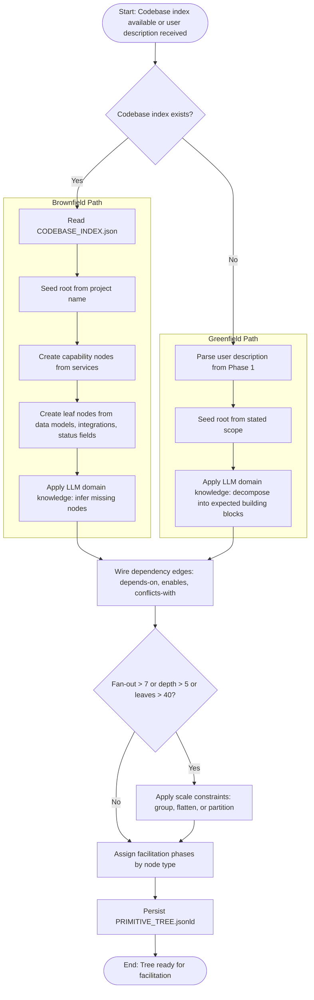
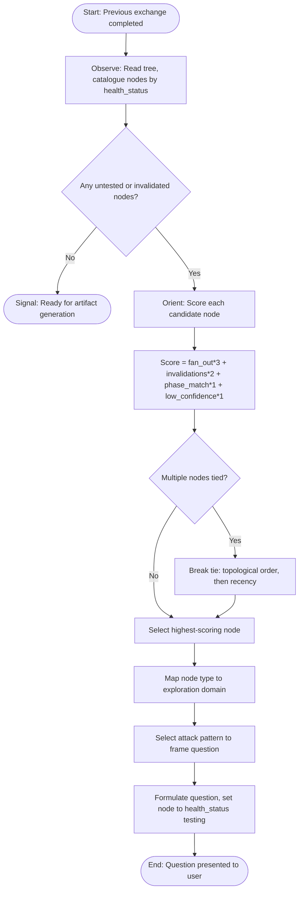
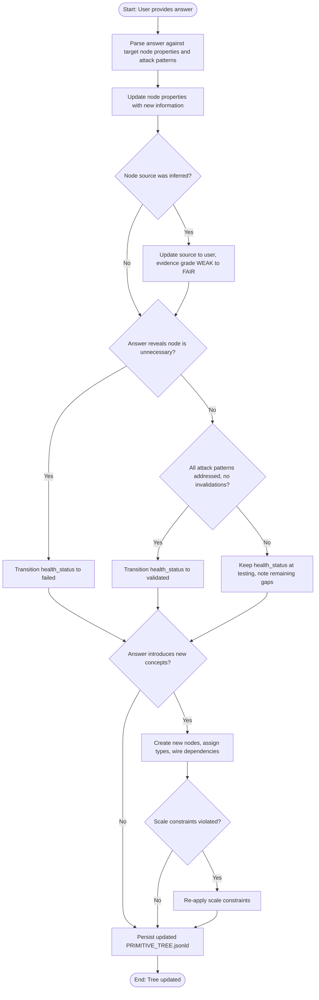
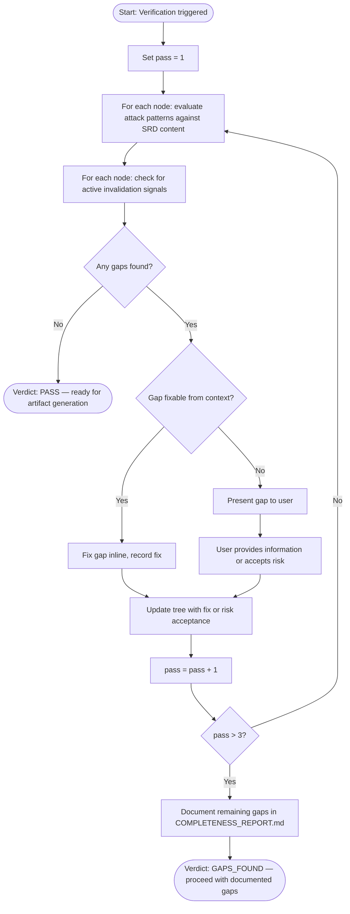

# Process Flow Diagrams: Primitive Tree Architecture

**Version:** 1.0.0
**Date:** 2026-03-16

---

## Summary

Four process flows capture the key workflows of the primitive tree system: tree synthesis
(how the tree is created), the OODA spiral (how facilitation questions are selected),
tree update (how user input changes the tree), and completeness verification (how the
tree is checked for gaps before artifact generation).

---

## PF-01: Tree Synthesis Process

**Related Use Case:** UC-01, UC-02
**Trigger:** CODEBASE_INDEX.json produced (brownfield) or user describes system in orientation (greenfield)
**End State:** PRIMITIVE_TREE.jsonld persisted to specification folder

#### Process Steps

| Step | Description | Actor/System | Inputs | Outputs | Business Rules |
|------|-------------|-------------|--------|---------|----------------|
| 1 | Detect brownfield vs. greenfield | System | Presence of CODEBASE_INDEX.json | Path selection | — |
| 2a | Read codebase index | System | CODEBASE_INDEX.json | Parsed services, models, integrations | — |
| 2b | Parse user description | System | Phase 1 conversation | System scope description | — |
| 3 | Create initial nodes | System | Parsed evidence or description | Tree nodes with types and sources | BR-03, BR-05 |
| 4 | Apply LLM inference | System | Domain knowledge + evidence | Additional "inferred" nodes | BR-03 |
| 5 | Wire dependencies | System | Node list | Typed edges | — |
| 6 | Apply scale constraints | System | Tree structure | Restructured tree | BR-01, BR-02 |
| 7 | Assign phases | System | Node types | Phase assignments | — |
| 8 | Persist | System | Complete tree | PRIMITIVE_TREE.jsonld | — |

#### Decision Points

| Decision | Criteria | Yes Path | No Path |
|----------|----------|----------|---------|
| Codebase index exists? | File present and parseable in `.specifications/{name}/` | Brownfield path | Greenfield path |
| Scale constraints violated? | Fan-out > 7 at any node, depth > 5, or leaf count > 40 | Apply constraints then assign phases | Assign phases directly |

---

## PF-02: OODA Spiral — Question Selection

**Related Use Case:** UC-03
**Trigger:** Previous facilitation exchange completed; tree has untested or invalidated nodes
**End State:** One facilitation question formulated and presented to user

#### Process Steps

| Step | Description | Actor/System | Inputs | Outputs | Business Rules |
|------|-------------|-------------|--------|---------|----------------|
| 1 | Observe tree state | System | PRIMITIVE_TREE.jsonld | Node catalogue by status | — |
| 2 | Score candidates | System | Node properties, dependency graph | Scored candidate list | BR-08 |
| 3 | Select target node | System | Scored list | Single target node | BR-06 |
| 4 | Map to exploration domain | System | Node type | Domain assignment | — |
| 5 | Select attack pattern | System | Node type's attack_patterns | Question angle | — |
| 6 | Formulate question | System | Attack pattern, node context | Facilitation question | BR-07 |

#### Decision Points

| Decision | Criteria | Yes Path | No Path |
|----------|----------|----------|---------|
| Any gaps remain? | At least one node with health_status untested or with active invalidation signals | Continue to scoring | Signal artifact generation readiness |
| Multiple nodes tied? | Two or more nodes with identical composite score | Tie-break procedure | Select the single highest scorer |

---

## PF-03: Tree Update from User Input

**Related Use Case:** UC-04
**Trigger:** User responds to a facilitation question
**End State:** Tree updated and persisted with new information

#### Decision Points

| Decision | Criteria | Yes Path | No Path |
|----------|----------|----------|---------|
| Node source was inferred? | source property is "inferred" and user has now confirmed or provided detail | Promote to "user" | Proceed to health evaluation |
| Answer reveals node unnecessary? | User explicitly says not needed, or invalidation signal matched | Mark failed | Evaluate completeness |
| All attack patterns addressed? | Every attack pattern for this node type has been addressed in the conversation; no active invalidation signals | Mark validated | Keep testing |
| New concepts introduced? | User's answer describes building blocks not in the current tree | Create new nodes and wire | Persist directly |
| Scale constraints violated? | New nodes push fan-out > 7 or depth > 5 | Re-apply constraints | Persist directly |

---

## PF-04: Completeness Verification

**Related Use Case:** UC-06
**Trigger:** Facilitation reaches Phase 5 (verify) or circuit breaker triggers
**End State:** Tree verified, gaps documented, ready for artifact generation

#### Decision Points

| Decision | Criteria | Yes Path | No Path |
|----------|----------|----------|---------|
| Any gaps found? | At least one node with unaddressed attack patterns or active invalidation signals | Classify and fix | Verdict PASS |
| Gap fixable from context? | Enough information exists in the conversation or codebase to fill the gap without user input | Fix inline | Surface to user |
| Max passes exceeded? | Pass counter > 3 | Document remaining gaps | Re-evaluate |
