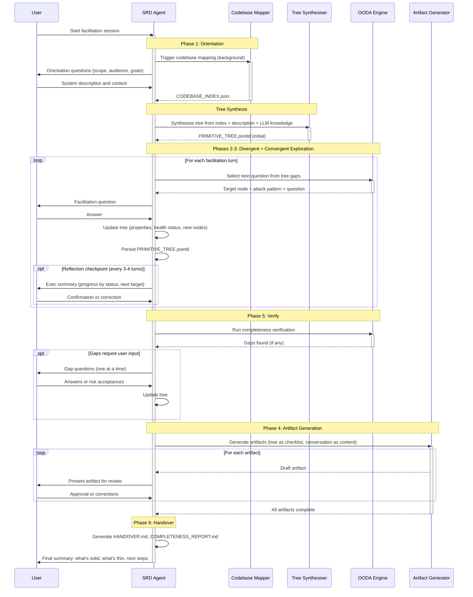

# Sequence Diagrams: Primitive Tree Architecture

**Version:** 1.0.0
**Date:** 2026-03-16

---

## Summary

Two sequence diagrams capture the key interaction patterns: the end-to-end facilitation
session (from codebase mapping through tree synthesis, facilitation, and artifact generation)
and the single-turn facilitation exchange (the detailed interaction within one OODA spiral
pass).

---

## SD-01: End-to-End Facilitation Session

**Related Use Case:** UC-01 through UC-08
**Participants:** User, SRD Agent, Codebase Mapper, Tree Synthesiser, OODA Engine, Artifact Generator
**Trigger:** User initiates a requirements facilitation session



#### Interaction Notes

| Step | From | To | Data | Notes |
|------|------|----|------|-------|
| 1 | User | Agent | Session start | User describes what they want to specify |
| 2 | Agent | Mapper | Trigger | Background task — does not block facilitation |
| 3 | Mapper | Agent | CODEBASE_INDEX.json | Overlaid at next reflection checkpoint, not announced |
| 4 | Agent | Synth | Index + description + LLM knowledge | Brownfield or greenfield path selected automatically |
| 5 | Synth | Agent | PRIMITIVE_TREE.jsonld | Initial tree with all nodes untested |
| 6 | OODA | Agent | Question selection | Composite scoring: fan-out, invalidations, phase, confidence |
| 7 | Agent | User | Question | Framed by attack pattern; includes educated assumption |
| 8 | User | Agent | Answer | Parsed against target node properties |
| 9 | Agent | ArtGen | Tree + conversation | Tree provides structure; conversation provides content |
| 10 | ArtGen | User | Artifacts | One at a time for review |

---

## SD-02: Single Facilitation Turn (OODA Detail)

**Related Use Case:** UC-03, UC-04
**Participants:** SRD Agent, OODA Engine, Primitive Tree, User
**Trigger:** Previous facilitation exchange completed

```mermaid
sequenceDiagram
    participant Agent as SRD Agent
    participant OODA as OODA Engine
    participant Tree as PRIMITIVE_TREE.jsonld
    participant U as User

    Agent->>Tree: Read current state
    activate Tree
    Tree-->>Agent: All nodes with statuses, dependencies, properties
    deactivate Tree

    Agent->>OODA: Observe: catalogue by health_status
    activate OODA
    OODA->>OODA: Orient: score candidates (fan_out*3 + invalidations*2 + phase*1 + confidence*1)
    OODA->>OODA: Decide: select highest scorer, break ties by topology then recency
    OODA-->>Agent: Target node ID, attack pattern, exploration domain
    deactivate OODA

    Agent->>Tree: Set target node health_status = testing
    activate Tree
    Tree-->>Agent: Confirmed
    deactivate Tree

    Agent->>U: Question framed by attack pattern + educated assumption
    activate U
    U-->>Agent: Answer
    deactivate U

    Agent->>Agent: Parse answer against node properties

    alt Answer fully specifies node
        Agent->>Tree: Update properties, set health_status = validated, source = user
    else Answer partially specifies
        Agent->>Tree: Update properties, keep health_status = testing, note gaps
    else Answer reveals node unnecessary
        Agent->>Tree: Set health_status = failed
        Agent->>Tree: Propagate: flag dependants for re-evaluation
    else Answer introduces new concepts
        Agent->>Tree: Create new nodes, wire dependencies, assign phases
        Agent->>Tree: Re-apply scale constraints if needed
    end

    Agent->>Tree: Persist updated tree
