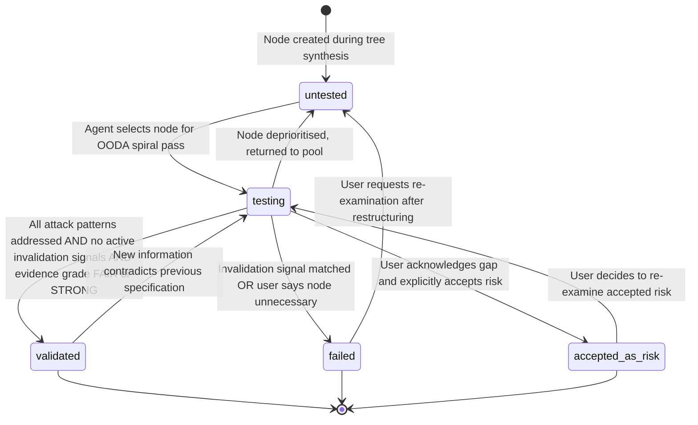
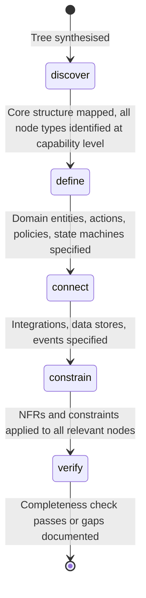

# State Diagrams: Primitive Tree Architecture

**Version:** 1.0.0
**Date:** 2026-03-16

---

## Summary

Two state machines govern the primitive tree system: the node health status lifecycle
(tracking specification completeness of each tree node) and the facilitation phase
progression (tracking which stage of requirements specification the tree is in).

---

## ST-01: Node Health Status Lifecycle

**Entity:** Primitive tree node (any node type)
**Related Use Cases:** UC-03, UC-04, UC-06
**Purpose:** Tracks the specification completeness of each node. Determines which nodes need
facilitation attention (untested, testing), which are ready for artifact generation (validated),
which should be removed or restructured (failed), and which have known gaps the user has
accepted (accepted-as-risk). The agent's question selection (UC-03) targets nodes based on
their health status.

#### States

| State | Description | Entry Conditions | Allowed Actions |
|-------|-------------|-----------------|-----------------|
| untested | Node exists but has not been explored in facilitation. Default for all nodes at creation. | Tree synthesis creates node; or node returned from testing/failed | Available for OODA selection |
| testing | Node is currently being explored. Agent is asking questions about it or user is providing detail. | Agent selects node via OODA scoring | Update properties, evaluate attack patterns, check invalidation signals |
| validated | Specification is complete enough to implement. All attack patterns addressed, no active invalidation signals. | All attack patterns addressed, evidence grade FAIR+, user confirmed | Include in artifact generation, available for dependency resolution |
| failed | Node examined and found incorrect, unnecessary, or misconceived. | Invalidation signal matched, or user explicitly rejects | Remove from tree or restructure; propagate failure to dependants |
| accepted-as-risk | Known gaps exist but user chooses to proceed. Risk documented. | User acknowledges specific gap and accepts | Include in artifacts with risk annotation; flag in COMPLETENESS_REPORT.md |

#### Transitions

| From | To | Trigger | Guard Conditions | Side Effects |
|------|----|---------|-----------------|--------------|
| [initial] | untested | Tree synthesis creates node | — | Node properties populated with defaults; source set |
| untested | testing | OODA spiral selects this node | Node has highest composite score among candidates | Node becomes the target of next facilitation question |
| testing | validated | User provides complete specification | All attack patterns for node type addressed; no active invalidation signals; evidence grade is FAIR (user confirmed) or STRONG (codebase evidenced) | Node's artifact affinities become active for artifact generation |
| testing | failed | Invalidation signal matched or user rejects | At least one invalidation signal matched with evidence, or user explicitly says node is unnecessary | Propagate failure via depends-on edges: dependants flagged for re-evaluation |
| testing | accepted-as-risk | User accepts known gap | User has been presented with the specific gap and explicitly accepts | Risk recorded on node; flagged in COMPLETENESS_REPORT.md |
| testing | untested | Node deprioritised | Higher-priority node emerges; agent switches focus | No side effects; node returns to candidate pool |
| failed | untested | Re-examination requested | User requests re-examination after restructuring the node or its context | Previous failure evidence cleared; fresh evaluation starts |
| accepted-as-risk | testing | User reconsiders | User decides the accepted risk needs resolution after all | Previous risk acceptance recorded as historical |
| validated | testing | Contradiction discovered | New information from later facilitation contradicts the validated specification | Validation cleared; node re-enters facilitation |

#### Invalid Transitions

| From | To | Why Invalid |
|------|----|------------|
| untested | validated | Cannot validate without exploration — must pass through testing first |
| untested | failed | Cannot fail without examination — must be tested to determine failure |
| untested | accepted-as-risk | Cannot accept risk without knowing what the risk is — must be tested first |
| failed | validated | Cannot validate a failed node directly — must return to untested first, then re-examine through testing |
| failed | accepted-as-risk | Cannot accept risk on a failed node — must return to untested first for fresh evaluation |

---

## ST-02: Facilitation Phase Progression

**Entity:** The primitive tree as a whole (not individual nodes)
**Related Use Cases:** UC-03
**Purpose:** Tracks which stage of requirements specification the facilitation is in. Phases
are ordered and progressive — the tree moves through them as facilitation progresses. Phase
determines which node types are natural candidates for the OODA spiral (phase_match scoring
factor).

#### States

| State | Description | Entry Conditions | Allowed Actions |
|-------|-------------|-----------------|-----------------|
| discover | Initial decomposition. Tree skeleton created from codebase or description. All nodes start here. | Tree synthesis completed | Broad exploration; identify missing nodes; confirm tree structure |
| define | Convergent specification of core building blocks. Pins down exact behaviour, data shapes, rules. | Core structure stable — no major new nodes being added | Specify domain-entity attributes, action flows, policy rules, state-machine transitions |
| connect | Integration and data flow specification. Maps how pieces communicate. | Core building blocks well-specified | Specify integration protocols, data store schemas, event contracts |
| constrain | NFRs and boundaries. Performance, security, scale, availability targets. | Integrations and data flows specified | Apply NFR constraints to all relevant nodes; add policy nodes for cross-cutting concerns |
| verify | Completeness checking. Audit the tree for gaps, orphans, untested assumptions. | NFRs applied | Run completeness verification (UC-06); fix gaps or document them |

#### Transitions

| From | To | Trigger | Guard Conditions | Side Effects |
|------|----|---------|-----------------|--------------|
| [initial] | discover | Tree synthesis completes | PRIMITIVE_TREE.jsonld persisted | phase_match scoring activates for discover-phase nodes |
| discover | define | Structure stabilises | Last 3 facilitation turns refined rather than introduced new concepts; all 6 exploration domains have substantive coverage | phase_match scoring shifts to define-phase nodes |
| define | connect | Core nodes specified | Majority of domain-entity, action, policy, state-machine nodes at health_status validated or testing | phase_match scoring shifts to connect-phase nodes |
| connect | constrain | Connections mapped | Majority of integration, data-store, event nodes at health_status validated or testing | phase_match scoring shifts to constrain-phase nodes; NFR template presented |
| constrain | verify | Constraints applied | NFR categories have measurable targets; policy nodes have enforcement points | Completeness verification begins (UC-06) |

#### Invalid Transitions

| From | To | Why Invalid |
|------|----|------------|
| discover | connect | Cannot specify integrations before core building blocks are identified |
| discover | constrain | Cannot apply constraints before knowing what to constrain |
| define | verify | Cannot verify before integrations and constraints are specified |
| Any phase | Any earlier phase | Phases are progressive; no backward movement (though individual nodes can return to untested) |
