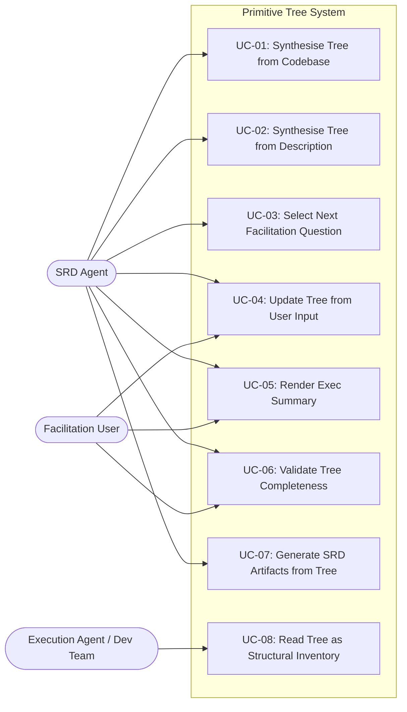

# Use Case Diagrams: Primitive Tree Architecture

**Version:** 1.0.0
**Date:** 2026-03-16

---

## Summary

Three actors interact with the primitive tree system: the SRD agent (automated — performs
tree synthesis, gap-driven facilitation, and artifact generation), the facilitation user
(human — provides domain knowledge, confirms specifications, reviews artifacts), and the
execution agent or development team (downstream consumer — reads the tree as a structural
inventory alongside the SRD's behavioural specification).

---

## UC-OVERVIEW: System Use Case Map

---

## UC-01: Synthesise Tree from Codebase (Brownfield)

**Actor:** SRD Agent
**Goal:** Produce an initial PRIMITIVE_TREE.jsonld by combining codebase evidence with LLM domain knowledge.
**Priority:** High
**Preconditions:**
- CODEBASE_INDEX.json exists in `.specifications/{name}/`
- No PRIMITIVE_TREE.jsonld exists yet (or user has requested resynthesis)

**Postconditions (success):**
- PRIMITIVE_TREE.jsonld exists with root node, intermediate capability nodes, and leaf primitives
- Each leaf has a node type, health_status of "untested", source of "codebase" or "inferred", and facilitation phase
- Dependencies are wired with typed edges
- Scale constraints applied (fan-out ≤ 7, depth ≤ 5)

**Postconditions (failure):**
- CODEBASE_INDEX.json is malformed or empty — agent logs error, falls back to UC-02 (description-based synthesis)

#### Basic Flow

| Step | Actor | System |
|------|-------|--------|
| 1 | | Read CODEBASE_INDEX.json: extract services, data models, integrations, routes, patterns |
| 2 | | Seed root node from project name or user-stated scope |
| 3 | | For each service, create intermediate capability node |
| 4 | | For each data model, create domain-entity leaf; for each integration, create integration leaf; for each model with status fields, create state-machine leaf |
| 5 | | Apply LLM domain knowledge: infer expected nodes the codebase lacks, mark as source "inferred" |
| 6 | | Wire depends-on, enables, conflicts-with edges based on import graphs, API call chains, and domain inference |
| 7 | | Apply scale constraints: group if fan-out > 7, flatten if depth > 5, partition into bounded contexts if > 40 leaves |
| 8 | | Assign facilitation phases to each leaf based on node type defaults |
| 9 | | Persist PRIMITIVE_TREE.jsonld to `.specifications/{name}/` |

#### Alternate Flows

**AF-01: Large codebase requiring bounded context scoping**
- Branches from: Step 7
- Condition: Leaf count exceeds 40

| Step | Actor | System |
|------|-------|--------|
| 7.1 | | Identify natural module boundaries from codebase service structure |
| 7.2 | | Create bounded context intermediate nodes, reparent leaves under them |
| 7.3 | | Verify fan-out ≤ 7 at each level after reparenting |

- Rejoins: Step 8

#### Exception Flows

**EF-01: Malformed codebase index**
- Branches from: Step 1
- Condition: CODEBASE_INDEX.json cannot be parsed or is empty

| Step | Actor | System |
|------|-------|--------|
| 1.1 | | Log warning: "Codebase index malformed, falling back to description-based synthesis" |
| 1.2 | | Proceed to UC-02 |

- Result: Graceful degradation to greenfield path

#### Business Rules

| ID | Rule | Applies To |
|----|------|------------|
| BR-01 | Fan-out must not exceed 7 children per node | Step 7 |
| BR-02 | Tree depth must not exceed 5 levels | Step 7 |
| BR-03 | Codebase-evidenced nodes get source "codebase"; LLM-inferred nodes get source "inferred" | Steps 4, 5 |
| BR-04 | All leaf nodes start with health_status "untested" | Steps 4, 5 |

---

## UC-02: Synthesise Tree from Description (Greenfield)

**Actor:** SRD Agent
**Goal:** Produce an initial PRIMITIVE_TREE.jsonld from the user's verbal description when no codebase exists.
**Priority:** High
**Preconditions:**
- No CODEBASE_INDEX.json exists (greenfield project), or UC-01 fell back
- User has described the system in Phase 1 orientation

**Postconditions (success):**
- PRIMITIVE_TREE.jsonld exists with all nodes sourced as "inferred" and health_status "untested"

**Postconditions (failure):**
- User description too vague — tree has only root node and 1-2 capability nodes. Agent notes thin tree in exec summary and uses facilitation to flesh it out.

#### Basic Flow

| Step | Actor | System |
|------|-------|--------|
| 1 | | Parse user's description from Phase 1 orientation conversation |
| 2 | | Seed root node from stated scope |
| 3 | | Apply LLM domain knowledge: for the described domain, decompose into expected architectural building blocks |
| 4 | | Create leaf nodes for each identified building block, all with source "inferred" |
| 5 | | Wire dependency edges from domain inference |
| 6 | | Apply scale constraints |
| 7 | | Assign facilitation phases |
| 8 | | Persist PRIMITIVE_TREE.jsonld |

#### Business Rules

| ID | Rule | Applies To |
|----|------|------------|
| BR-05 | All greenfield nodes start with source "inferred" and health_status "untested" | Step 4 |
| BR-01 | Fan-out ≤ 7 | Step 6 |
| BR-02 | Depth ≤ 5 | Step 6 |

---

## UC-03: Select Next Facilitation Question (OODA Spiral)

**Actor:** SRD Agent
**Goal:** Choose the highest-priority tree gap and formulate a facilitation question targeting it.
**Priority:** High
**Preconditions:**
- PRIMITIVE_TREE.jsonld exists
- At least one node has health_status "untested" or has active invalidation signals

**Postconditions (success):**
- One node selected as the target for the next facilitation question
- Question formulated using the node's attack patterns and mapped to the appropriate exploration domain

**Postconditions (failure):**
- All nodes are validated or accepted-as-risk — no question needed, signal transition to artifact generation

#### Basic Flow

| Step | Actor | System |
|------|-------|--------|
| 1 | | **Observe:** Read tree. Catalogue nodes by health_status. Identify untested nodes, nodes with active invalidation signals, blocked dependency chains. |
| 2 | | **Orient:** Score each candidate node: (fan_out * 3) + (active_invalidations * 2) + (phase_match * 1) + (low_confidence * 1) |
| 3 | | **Decide:** Select highest-scoring node. Map to exploration domain by node type. Select attack pattern to frame the question. |
| 4 | | **Act:** Formulate facilitation question. Transition selected node to health_status "testing". |

#### Alternate Flows

**AF-02: Multiple nodes tied on score**
- Branches from: Step 3
- Condition: Two or more nodes have identical composite scores

| Step | Actor | System |
|------|-------|--------|
| 3.1 | | Break tie using topological order: upstream dependency first |
| 3.2 | | If still tied: prefer node with longer time since last exploration |

- Rejoins: Step 4

**AF-03: Phase transition detected**
- Branches from: Step 2
- Condition: All nodes in current facilitation phase are validated; nodes in next phase are untested

| Step | Actor | System |
|------|-------|--------|
| 2.1 | | Advance current facilitation phase to next phase |
| 2.2 | | Re-score nodes with updated phase_match values |

- Rejoins: Step 3

#### Business Rules

| ID | Rule | Applies To |
|----|------|------------|
| BR-06 | Topological ordering: upstream dependencies explored before downstream dependants | Step 3 |
| BR-07 | Agent inference (WEAK evidence) can identify gaps but cannot validate — only user confirmation (FAIR) or codebase evidence (STRONG) can validate | Step 4 |
| BR-08 | Composite score formula: (fan_out * 3) + (active_invalidations * 2) + (phase_match * 1) + (low_confidence * 1) | Step 2 |

---

## UC-04: Update Tree from User Input

**Actor:** SRD Agent (system), Facilitation User (input)
**Goal:** Incorporate the user's answer into the tree — update node properties, transition health statuses, create or remove nodes.
**Priority:** High
**Preconditions:**
- A facilitation question has been asked (UC-03 completed)
- User has responded

**Postconditions (success):**
- Tree reflects the user's input: properties updated, health_status transitioned, new nodes created or existing nodes removed as needed
- PRIMITIVE_TREE.jsonld persisted with updates

#### Basic Flow

| Step | Actor | System |
|------|-------|--------|
| 1 | User | Provides answer to facilitation question |
| 2 | | Parse answer against the target node's properties and attack patterns |
| 3 | | Update node properties with information from the answer |
| 4 | | Evaluate health_status transition (see ST-01: Node Health Status Lifecycle) |
| 5 | | If answer introduces new concepts: create new nodes, assign types, wire dependencies |
| 6 | | If answer reveals node is unnecessary: transition to "failed", mark for removal |
| 7 | | Persist updated PRIMITIVE_TREE.jsonld |

#### Alternate Flows

**AF-04: User confirms inferred node**
- Branches from: Step 3
- Condition: Node had source "inferred" and user confirms it

| Step | Actor | System |
|------|-------|--------|
| 3.1 | | Update source from "inferred" to "user" |
| 3.2 | | Evidence grade rises from WEAK to FAIR |

- Rejoins: Step 4

**AF-05: User restructures tree**
- Branches from: Step 5
- Condition: User's answer implies a different decomposition than the current tree

| Step | Actor | System |
|------|-------|--------|
| 5.1 | | Create new nodes for the restructured decomposition |
| 5.2 | | Reparent affected nodes under new structure |
| 5.3 | | Remove orphaned intermediate nodes |
| 5.4 | | Rewire dependencies |
| 5.5 | | Re-apply scale constraints |

- Rejoins: Step 7

#### Business Rules

| ID | Rule | Applies To |
|----|------|------------|
| BR-09 | User confirmation transitions source from "inferred" to "user" and evidence grade from WEAK to FAIR | Step 3 (AF-04) |
| BR-10 | New nodes introduced by user get source "user" | Step 5 |
| BR-01 | Fan-out ≤ 7 after restructuring | Step 5.5 |

---

## UC-05: Render Exec Summary

**Actor:** SRD Agent (renders), Facilitation User (reads)
**Goal:** Present the current tree state as a human-readable progress summary at reflection checkpoints.
**Priority:** Medium
**Preconditions:**
- PRIMITIVE_TREE.jsonld exists
- Reflection checkpoint reached (every 3-4 facilitation exchanges)

**Postconditions (success):**
- User sees a plain-language summary grouped by health status with counts and one-line descriptions
- Summary ends with the next question's target and rationale

#### Basic Flow

| Step | Actor | System |
|------|-------|--------|
| 1 | | Read PRIMITIVE_TREE.jsonld |
| 2 | | Group nodes by health_status: validated, testing, untested, failed/accepted-as-risk |
| 3 | | For each group, render node names with one-line descriptions and counts |
| 4 | | If any nodes have active invalidation signals, render in "Flagged" section |
| 5 | | Cap display at 20 nodes; show "(+N more)" for overflow |
| 6 | | Append next question target with rationale from OODA scoring |
| 7 | User | Reviews summary, confirms accuracy or corrects |

#### Business Rules

| ID | Rule | Applies To |
|----|------|------------|
| BR-11 | Maximum 20 nodes displayed per summary | Step 5 |
| BR-12 | Never show raw JSON, dependency edges, or phase assignments — plain language only | Steps 3, 4 |
| BR-13 | Always end with next question target and rationale | Step 6 |

---

## UC-06: Validate Tree Completeness

**Actor:** SRD Agent (validates), Facilitation User (reviews gaps)
**Goal:** Systematically check that all tree nodes are specified well enough for artifact generation.
**Priority:** High
**Preconditions:**
- Facilitation has reached Phase 5 (verify) or circuit breaker triggered
- Most nodes are at health_status "validated" or "accepted-as-risk"

**Postconditions (success):**
- Every node's attack patterns have been addressed
- No active invalidation signals remain (or are accepted-as-risk)
- Tree is ready for artifact generation

**Postconditions (failure):**
- Gaps remain after 3 passes — documented in COMPLETENESS_REPORT.md with specific flags

#### Basic Flow

| Step | Actor | System |
|------|-------|--------|
| 1 | | For each node, evaluate attack patterns: has each been addressed in the SRD content? |
| 2 | | For each node, evaluate invalidation signals: are any active? |
| 3 | | For gaps fixable from context: fix inline, record fix |
| 4 | | For gaps requiring user input: present to user, one at a time |
| 5 | User | Provides missing information or accepts risk |
| 6 | | Update tree with fixes and risk acceptances |
| 7 | | Repeat (max 3 passes) until no gaps remain or pass limit reached |

#### Business Rules

| ID | Rule | Applies To |
|----|------|------------|
| BR-14 | Maximum 3 completeness passes | Step 7 |
| BR-15 | Small gaps fixed inline; large gaps surfaced to user | Steps 3, 4 |

---

## UC-07: Generate SRD Artifacts from Tree

**Actor:** SRD Agent
**Goal:** Produce SRD.md, diagrams, NFR.md, and supporting documents using the tree as a structural completeness check and the facilitation conversation as the content source.
**Priority:** High
**Preconditions:**
- Tree completeness validated (UC-06 completed)
- Facilitation conversation contains sufficient detail for each validated node

**Postconditions (success):**
- Each node with artifactAffinity "use-case" has a corresponding use case in SRD.md
- Each node with artifactAffinity "sequence-diagram" has a diagram in diagrams/sequence-diagrams.md
- Each node with artifactAffinity "state-diagram" has a diagram in diagrams/state-diagrams.md
- And so on for all artifact affinities

#### Basic Flow

| Step | Actor | System |
|------|-------|--------|
| 1 | | Read PRIMITIVE_TREE.jsonld. Build artifact generation checklist from artifactAffinity of each validated node. |
| 2 | | Generate artifacts in template order: GLOSSARY, use-cases, process-flows, sequence-diagrams, state-diagrams, data-flows, NFR, SRD |
| 3 | | For each artifact, cross-reference tree nodes to verify coverage |
| 4 | | Flag any validated node not represented in at least one artifact |

#### Business Rules

| ID | Rule | Applies To |
|----|------|------------|
| BR-16 | Every validated node must appear in at least one artifact matching its artifactAffinity | Step 3 |
| BR-17 | Conversation is the primary content source; tree provides structure and completeness checking | Steps 2, 3 |

---

## UC-08: Read Tree as Structural Inventory

**Actor:** Execution Agent / Development Team
**Goal:** Use the primitive tree as a dependency-aware map of what exists vs. what's new, complementing the SRD's behavioural specification.
**Priority:** Medium
**Preconditions:**
- PRIMITIVE_TREE.jsonld exists in the specification folder
- SRD.md and HANDOVER.md exist

**Postconditions (success):**
- Reader understands the system's architectural building blocks, their dependencies, and their specification status
- Reader can identify which components are new (source "inferred" or "user") vs. existing (source "codebase")
- Reader can follow dependency ordering for implementation sequencing

#### Basic Flow

| Step | Actor | System |
|------|-------|--------|
| 1 | Dev Team | Read HANDOVER.md for artifact reading order |
| 2 | Dev Team | Read PRIMITIVE_TREE.jsonld (or its rendered summary in HANDOVER.md) |
| 3 | Dev Team | Identify new vs. existing components from source property |
| 4 | Dev Team | Follow depends-on edges for implementation ordering |
| 5 | Dev Team | Cross-reference nodes with SRD.md use cases and diagrams via artifact affinity |
