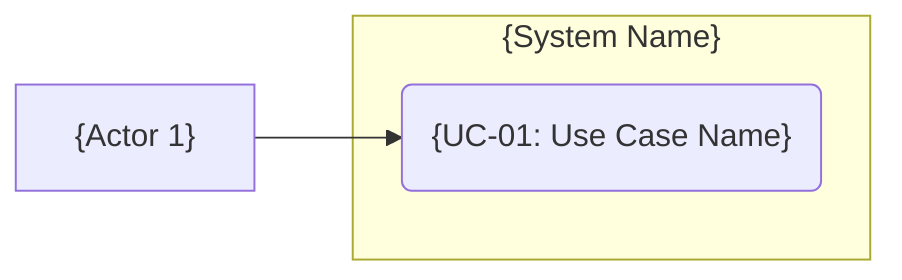
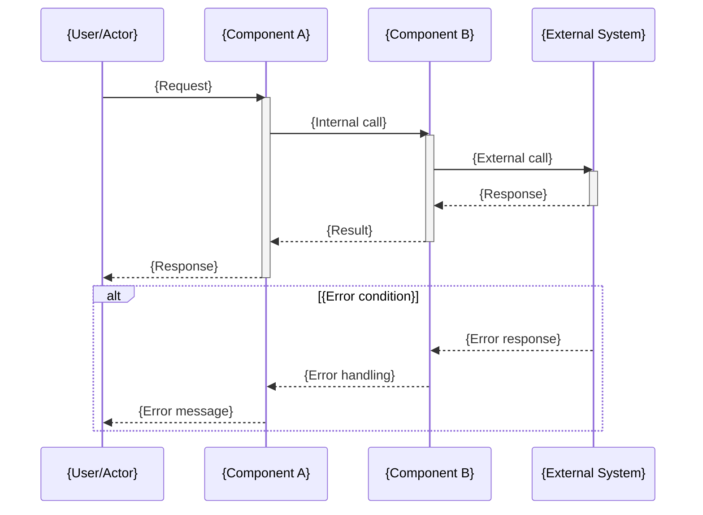
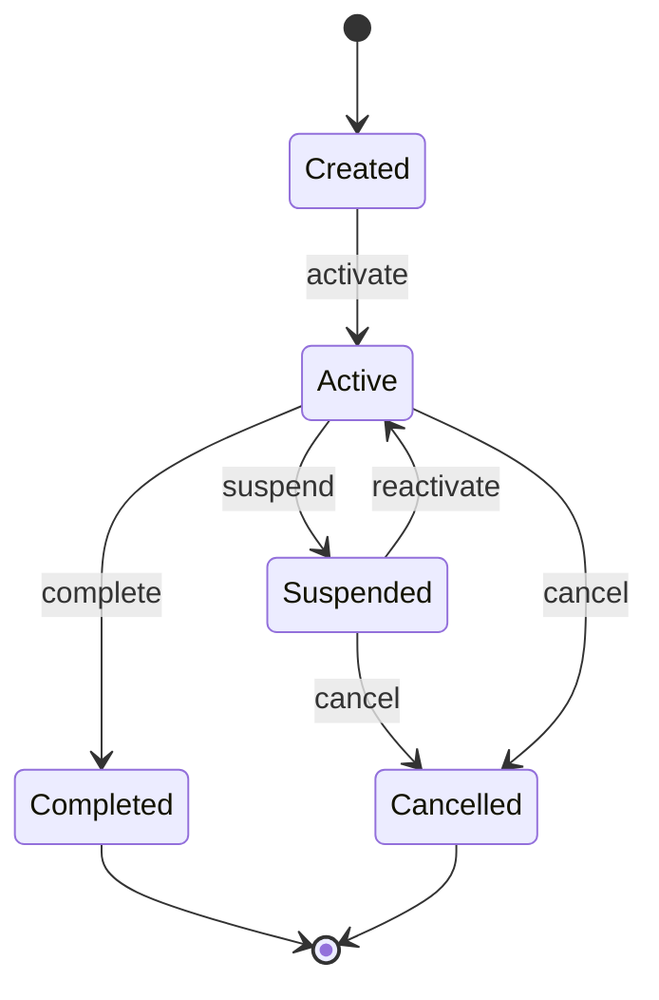
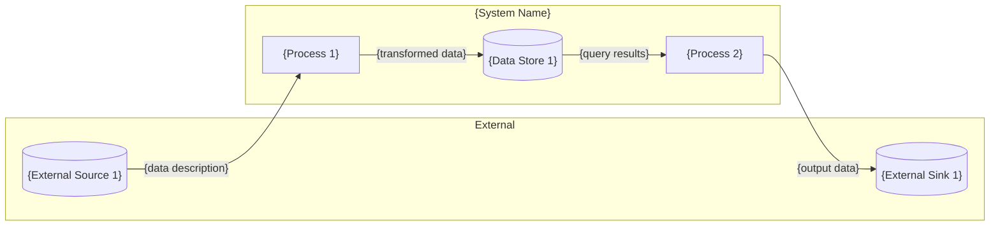

# SRD Artifact Templates

These templates define the structure for all artifacts produced during requirements
facilitation. Use them as the skeleton when generating artifacts in Phase 4 (Artifact
Generation). Replace `{placeholders}` with content from the facilitation session.

---

## SRD Template

# Software Requirements Document: {Project Name}

**Version:** {version}
**Date:** {date}
**Status:** Draft | Review | Approved
**Author:** {author} (facilitated by Requirements Analyst)

---

### 1. Introduction

#### 1.1 Purpose
{Why this document exists. What system, feature, or integration it specifies.}

#### 1.2 Scope
{What is in scope and what is explicitly out of scope.}

#### 1.3 Intended Audience
{Who will read this document and what they need from it.}

#### 1.4 Definitions and Acronyms
See [GLOSSARY.md](GLOSSARY.md) for the full domain glossary.

#### 1.5 References
{Related documents, existing specifications, external standards.}

---

### 2. Overall Description

#### 2.1 Product Perspective
{How this system fits into the larger context. Existing systems, integrations, users.}

#### 2.2 Product Functions (Summary)
{High-level summary of major functions. Detail is in Section 4.}

| Function | Description |
|----------|-------------|
| {F-01} | {Brief description} |

#### 2.3 User Classes and Characteristics

| Actor | Description | Frequency of Use | Technical Proficiency |
|-------|-------------|-------------------|----------------------|
| {Actor 1} | {Description} | {Daily/Weekly/etc.} | {High/Medium/Low} |

#### 2.4 Operating Environment
{Platforms, browsers, devices, infrastructure constraints.}

#### 2.5 Design and Implementation Constraints
{Technology constraints, regulatory requirements, standards compliance.}

#### 2.6 Assumptions and Dependencies
{What must be true for these requirements to be valid.}

---

### 3. External Interface Requirements

#### 3.1 User Interfaces
{UI requirements, accessibility requirements, responsive design constraints.}

#### 3.2 Hardware Interfaces
{If applicable.}

#### 3.3 Software Interfaces
{APIs consumed, databases, external services. Detail in diagrams/sequence-diagrams.md.}

#### 3.4 Communications Interfaces
{Protocols, data formats, sync/async patterns.}

---

### 4. System Features

#### 4.1 {Feature Name} [F-01]

**Priority:** {High | Medium | Low}

##### 4.1.1 Description
{What this feature does and why it exists.}

##### 4.1.2 Use Cases
See [diagrams/use-cases.md](diagrams/use-cases.md) — {UC-01, UC-02}.

##### 4.1.3 Functional Requirements

| ID | Requirement | Priority | Acceptance Criteria |
|----|-------------|----------|---------------------|
| FR-{01} | {Requirement} | {H/M/L} | {Measurable criterion} |

---

### 5. Non-Functional Requirements

See [NFR.md](NFR.md) for full non-functional requirements specification.

| Category | Summary |
|----------|---------|
| Performance | {Key performance targets} |
| Scalability | {Scaling requirements} |
| Security | {Security requirements} |
| Availability | {Uptime targets} |
| Data | {Data requirements} |

---

### 6. Diagrams

All diagrams use Mermaid notation for portability and version control.

| Diagram Type | File | Purpose |
|-------------|------|---------|
| Use Case | [diagrams/use-cases.md](diagrams/use-cases.md) | Actor-goal relationships |
| Process Flow | [diagrams/process-flows.md](diagrams/process-flows.md) | Activity/workflow diagrams |
| Sequence | [diagrams/sequence-diagrams.md](diagrams/sequence-diagrams.md) | Integration and interaction sequences |
| State | [diagrams/state-diagrams.md](diagrams/state-diagrams.md) | Entity lifecycle state machines |
| Data Flow | [diagrams/data-flows.md](diagrams/data-flows.md) | Data movement between components |

---

### 7. Traceability Matrix

| Goal | Use Cases | Diagrams | NFRs | Features |
|------|-----------|----------|------|----------|
| {G-01} | {UC-01, UC-02} | {use-cases, sequence} | {NFR-01} | {F-01} |

---

### 8. Appendices

#### 8.1 Exploration Journal
See [EXPLORATION_JOURNAL.md](EXPLORATION_JOURNAL.md) for the facilitation record.

#### 8.2 Completeness Report
See [COMPLETENESS_REPORT.md](COMPLETENESS_REPORT.md) for the verification assessment.

#### 8.3 Handover Brief
See [HANDOVER.md](HANDOVER.md) for the execution agent handover.

---

## Use Case Template

### UC-{ID}: {Use Case Name}

**Actor:** {Primary actor}
**Goal:** {What the actor is trying to achieve}
**Priority:** {High | Medium | Low}
**Preconditions:**
- {What must be true before this use case can begin}

**Postconditions (success):**
- {What is true when the use case completes successfully}

**Postconditions (failure):**
- {What is true when the use case fails}

#### Basic Flow

| Step | Actor | System |
|------|-------|--------|
| 1 | {Actor action} | |
| 2 | | {System response} |
| 3 | {Actor action} | |
| 4 | | {System response} |

#### Alternate Flows

**{AF-01}: {Alternate flow name}**
- Branches from: Step {N}
- Condition: {When this alternate flow triggers}

| Step | Actor | System |
|------|-------|--------|
| {N}.1 | {Action} | |
| {N}.2 | | {Response} |

- Rejoins: Step {M} | Ends

#### Exception Flows

**{EF-01}: {Exception name}**
- Branches from: Step {N}
- Condition: {Error condition}

| Step | Actor | System |
|------|-------|--------|
| {N}.1 | | {Error handling} |
| {N}.2 | | {User notification} |

- Result: {Outcome — retry, abort, degrade}

#### Business Rules

| ID | Rule | Applies To |
|----|------|------------|
| BR-{01} | {Business rule description} | Step {N} |

#### Use Case Diagram (Mermaid)



---

## Sequence Diagram Template

### {SD-ID}: {Sequence Name}

**Related Use Case:** {UC-ID}
**Participants:** {List of systems/components involved}
**Trigger:** {What initiates this sequence}



#### Interaction Notes

| Step | From | To | Data | Notes |
|------|------|----|------|-------|
| 1 | {From} | {To} | {Payload description} | {Protocol, auth, format} |

#### Error Handling

| Error Condition | Handler | User Impact | Recovery |
|----------------|---------|-------------|----------|
| {Condition} | {Component} | {What user sees} | {Auto-retry / manual / abort} |

#### Performance Expectations

| Interaction | Expected Latency | Timeout | Retry Policy |
|-------------|-----------------|---------|--------------|
| {Call} | {Target} | {Timeout} | {Retry count and backoff} |

---

## Process Flow Template

### {PF-ID}: {Process Name}

**Related Use Case:** {UC-ID}
**Trigger:** {What starts this process}
**End State:** {What constitutes process completion}

```mermaid
flowchart TD
    Start([Start: {Trigger}])
    Step1[{Step 1 description}]
    Decision1{"{Decision question}"}
    Step2[{Step 2a description}]
    Step3[{Step 2b description}]
    Step4[{Step 3 description}]
    End([End: {End state}])

    Start --> Step1
    Step1 --> Decision1
    Decision1 -->|Yes| Step2
    Decision1 -->|No| Step3
    Step2 --> Step4
    Step3 --> Step4
    Step4 --> End
```

#### Process Steps

| Step | Description | Actor/System | Inputs | Outputs | Business Rules |
|------|-------------|-------------|--------|---------|----------------|
| 1 | {Description} | {Who/what} | {Required inputs} | {Produced outputs} | {BR-IDs} |

#### Decision Points

| Decision | Criteria | Yes Path | No Path |
|----------|----------|----------|---------|
| {Decision} | {How the decision is made} | {Path} | {Path} |

---

## State Diagram Template

### {ST-ID}: {Entity Name} Lifecycle

**Entity:** {Entity name}
**Related Use Cases:** {UC-IDs}
**Purpose:** {Why this entity has state — what decisions depend on its current state}



#### States

| State | Description | Entry Conditions | Allowed Actions |
|-------|-------------|-----------------|-----------------|
| {Created} | {Description} | {How entity enters this state} | {What can happen in this state} |

#### Transitions

| From | To | Trigger | Guard Conditions | Side Effects |
|------|----|---------|-----------------|--------------|
| {State A} | {State B} | {What causes transition} | {Conditions that must be true} | {What else happens} |

#### Invalid Transitions

| From | To | Why Invalid |
|------|----|------------|
| {State A} | {State B} | {Why this transition is not allowed} |

---

## Data Flow Template

### {DF-ID}: {Data Flow Name}

**Scope:** {System-level | Feature-level | Integration-level}
**Related Use Cases:** {UC-IDs}



#### Data Stores

| ID | Name | Type | Contents | Access Pattern |
|----|------|------|----------|----------------|
| DS-{01} | {Name} | {Database/Cache/File/Queue} | {What data is stored} | {Read-heavy/Write-heavy/Both} |

#### Data Flows

| ID | From | To | Data | Format | Volume | Frequency |
|----|------|----|------|--------|--------|-----------|
| {Flow-01} | {Source} | {Destination} | {Description} | {JSON/CSV/Binary/etc.} | {Expected volume} | {Real-time/Batch/On-demand} |

#### Privacy and Sensitivity

| Data Element | Classification | Handling Requirements |
|-------------|---------------|----------------------|
| {Element} | {PII/Sensitive/Public} | {Encryption/Masking/Retention} |

---

## NFR Template

### Performance

| ID | Requirement | Metric | Target | Measurement Method |
|----|-------------|--------|--------|-------------------|
| NFR-P01 | {Requirement} | {Metric name} | {Specific threshold} | {How measured} |

### Scalability

| ID | Requirement | Metric | Target | Measurement Method |
|----|-------------|--------|--------|-------------------|
| NFR-S01 | {Requirement} | {Metric name} | {Specific threshold} | {How measured} |

### Security

| ID | Requirement | Category | Implementation | Verification |
|----|-------------|----------|----------------|-------------|
| NFR-SEC01 | {Requirement} | {Auth/Encryption/Access/Audit} | {How implemented} | {How verified} |

### Availability

| ID | Requirement | Metric | Target | Measurement Method |
|----|-------------|--------|--------|-------------------|
| NFR-A01 | {Requirement} | {Metric name} | {Specific threshold} | {How measured} |

### Data

| ID | Requirement | Category | Implementation | Verification |
|----|-------------|----------|----------------|-------------|
| NFR-D01 | {Requirement} | {Retention/Backup/Recovery/Privacy} | {How implemented} | {How verified} |

**NFR Quality Criteria:** Every NFR MUST be measurable (specific threshold), testable
(pass/fail against threshold), traceable (linked to business goal), and achievable.

---

## PRIMITIVE_TREE.jsonld Template

```json
{
  "@context": {
    "@vocab": "https://sulis.co/ontology/primitive-tree/",
    "schema": "http://schema.org/",
    "prim": "https://sulis.co/ontology/primitive-tree/",
    "name": "schema:name",
    "description": "schema:description"
  },
  "@id": "prim:tree-{project-name}",
  "@type": "prim:PrimitiveTree",
  "name": "{Project Name} — Primitive Tree",
  "synthesised_at": "{ISO-8601 timestamp}",
  "synthesis_path": "{brownfield | greenfield}",
  "source_index": "{CODEBASE_INDEX.json | null}",
  "@graph": [
    {
      "@id": "{node-id}",
      "@type": "prim:{node-type}",
      "name": "{Human-readable name}",
      "definition": "{What this node represents in the target domain}",
      "success_criterion": "{Measurable condition confirming correct specification}",
      "health_status": "{untested | testing | validated | failed | accepted-as-risk}",
      "phase": "{discover | define | connect | constrain | verify}",
      "artifactAffinity": ["{use-case | process-flow | sequence-diagram | state-diagram | data-flow | business-rule | nfr}"],
      "source": "{codebase | inferred | user}",
      "parent": "{parent-node-id | null}",
      "dependencies": [
        {"target": "{target-node-id}", "type": "{depends-on | enables | conflicts-with}"}
      ]
    }
  ]
}
```

**Example nodes by type:**

```json
// domain-entity
{"@id": "node-user", "@type": "prim:domain-entity", "name": "User", "definition": "A person who has registered an account", "success_criterion": "All user attributes and relationships specified", "health_status": "untested", "phase": "define", "artifactAffinity": ["use-case", "data-flow"], "source": "codebase", "parent": "root", "attributes": ["id", "email", "role"], "relationships": ["has-many Orders"]}

// action
{"@id": "node-place-order", "@type": "prim:action", "name": "Place Order", "definition": "User submits a new order for processing", "success_criterion": "Complete flow specified including validation, payment, and confirmation", "health_status": "untested", "phase": "define", "artifactAffinity": ["use-case", "process-flow"], "source": "inferred", "parent": "root", "actor": "Customer"}

// integration
{"@id": "node-stripe", "@type": "prim:integration", "name": "Stripe Payment Gateway", "definition": "External payment processing service", "success_criterion": "Protocol, auth, error handling, and data contract specified", "health_status": "untested", "phase": "connect", "artifactAffinity": ["sequence-diagram", "data-flow"], "source": "codebase", "parent": "root", "external_system": "Stripe", "direction": "outbound"}

// data-store
{"@id": "node-postgres", "@type": "prim:data-store", "name": "Primary Database", "definition": "PostgreSQL database storing all domain entities", "success_criterion": "Retention, backup, and access patterns specified", "health_status": "untested", "phase": "connect", "artifactAffinity": ["data-flow"], "source": "codebase", "parent": "root", "store_type": "relational", "entities": ["User", "Order"]}

// state-machine
{"@id": "node-order-lifecycle", "@type": "prim:state-machine", "name": "Order Lifecycle", "definition": "States an order passes through from creation to completion", "success_criterion": "All states, transitions, triggers, and guards specified", "health_status": "untested", "phase": "define", "artifactAffinity": ["state-diagram"], "source": "inferred", "parent": "root", "entity": "Order", "states": ["draft", "submitted", "processing", "completed", "cancelled"]}

// policy
{"@id": "node-auth-policy", "@type": "prim:policy", "name": "Authentication Policy", "definition": "All API endpoints require authenticated access", "success_criterion": "Auth method, token lifecycle, and violation handling specified", "health_status": "untested", "phase": "define", "artifactAffinity": ["business-rule", "nfr"], "source": "inferred", "parent": "root", "policy_type": "authorization"}

// event
{"@id": "node-order-placed", "@type": "prim:event", "name": "Order Placed Event", "definition": "Published when a new order is successfully submitted", "success_criterion": "Trigger, payload, consumers, and delivery guarantees specified", "health_status": "untested", "phase": "connect", "artifactAffinity": ["sequence-diagram", "data-flow"], "source": "inferred", "parent": "root", "trigger": "Order transitions to submitted state", "consumers": ["Inventory Service", "Notification Service"]}
```

---

## HANDOVER.md Tree Section Template

Include this section in HANDOVER.md when a PRIMITIVE_TREE.jsonld exists:

### Structural Inventory (Primitive Tree)

**File:** [PRIMITIVE_TREE.jsonld](PRIMITIVE_TREE.jsonld)

The primitive tree provides a structural decomposition of the system's architectural
building blocks — the components, integrations, policies, and data stores that make up
the system. It complements the SRD's behavioural specification (use cases, flows, rules)
with a structural inventory.

#### New vs. Existing Components

| Category | Count | Description |
|----------|-------|-------------|
| Existing (source: codebase) | {n} | Components identified from the existing codebase |
| New — user specified (source: user) | {n} | Components specified during facilitation |
| New — inferred (source: inferred) | {n} | Components inferred by the analyst, confirmed during facilitation |

#### Implementation Sequencing

The tree's `depends-on` edges indicate implementation ordering. Build upstream
dependencies before downstream dependants:

1. {First tier — nodes with no upstream dependencies}
2. {Second tier — nodes that depend only on tier 1}
3. {Third tier — nodes that depend on tier 1 or 2}
...

Nodes connected by `conflicts-with` edges represent architectural alternatives —
resolve these decisions before implementing either option.

#### Reading the Tree

- **For human consumption:** Read the exec summary above for a plain-language overview.
- **For programmatic use:** Parse PRIMITIVE_TREE.jsonld. Each node in `@graph` has typed
  properties, health status, and dependency edges. Use `artifactAffinity` to locate the
  relevant SRD artifacts for each component.

---

## Glossary Template

| Term | Definition | Context | First Appeared |
|------|-----------|---------|----------------|
| {Term} | {Precise definition as used in this domain} | {Where/how this term is used} | {Phase/turn where it was introduced} |

### Synonyms and Disambiguation

| Preferred Term | Also Known As | NOT the Same As |
|---------------|---------------|-----------------|
| {Preferred} | {Synonyms used during exploration} | {Terms that sound similar but mean different things} |
