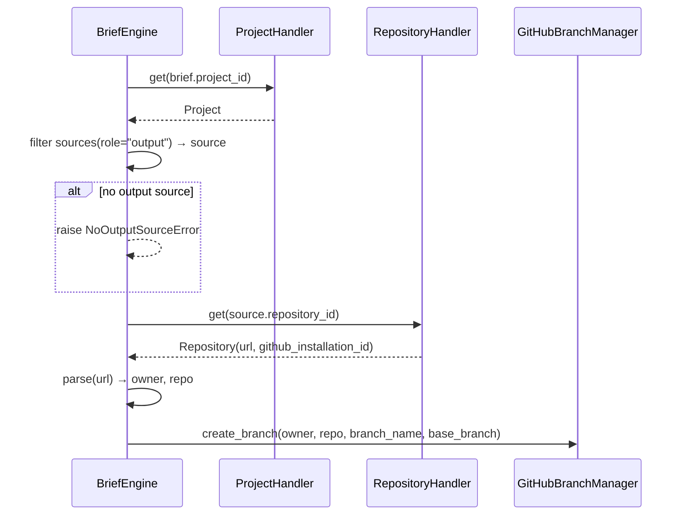

# Completeness Spiral Skill

> **Purpose:** Pre-validate specification completeness before the Design Validator runs.
> **Scope-aware:** Loads check specifications per scope from methodology.
>
> **Invoked by:** solution-design OUTCOME.md Activity 4.4c
> **Runs before:** Design Validator (Activity 4.5)
> **Output:** PASS or GAPS_FOUND verdict with gap inventory
>
> ## Execution
>
> **The completeness spiral specifications are the source of truth (fetch via GitHub MCP):**
> ```
> Fetch: mcp__github__get_file_contents(owner, repo, path="methodology/delivery/product/verification/completeness-spiral/engine.yaml", ref)
> Fetch: mcp__github__get_file_contents(owner, repo, path="methodology/delivery/product/verification/completeness-spiral/shared.yaml", ref)
> Fetch: mcp__github__get_file_contents(owner, repo, path="methodology/delivery/product/verification/completeness-spiral/{scope}.yaml", ref)
> ```
> Use `ofm-bindings.yaml` for repo config. See `skills/shared/bindings.md` for resolution pattern.
>
> 1. Read `engine.yaml` for the spiral mechanism (3-pass convergence, termination, output format)
> 2. Read `shared.yaml` for checks that apply to all scopes
> 3. Read `{scope}.yaml` for each scope in the feature's resolved set (from LIFECYCLE_STATE.json)
> 4. Execute all checks through the spiral mechanism
>
> **Scope files:** `backend.yaml`, `frontend-web.yaml`, `infrastructure.yaml`
>
> The check specifications define WHAT to verify. The LLM determines HOW to verify each check
> against the actual design artifacts. Structural checks can be verified by parsing document
> structure. Semantic checks require understanding meaning. Trace checks require following chains
> through multiple sections.
>
> ## Legacy Content (Below)
>
> The detailed perspectives below are the BACKEND checks from v1.6.0. They remain as reference
> for backward compatibility but the authoritative source is now the YAML specifications in
> `delivery/product/verification/completeness-spiral/` (on the methodology repo).
> Frontend and infrastructure checks exist ONLY in the YAML specifications.

---

## Why This Exists

The Design Validator checks structural completeness against the template and convention compliance.
It does not check whether Section 10.4 entries have sufficient contract depth — it can only verify
that the section exists. A correctly-structured but thinly-specified Section 10.4 passes the
Design Validator. The Completeness Spiral checks what the Design Validator cannot: are the contracts
actually typed, or are they narrative descriptions that look like contracts?

**Scope boundary (non-negotiable):** The Completeness Spiral catches incomplete contracts, not wrong
architectures. It does not replicate any Design Validator check:
- PLATFORM_CONVENTIONS.md compliance → Design Validator
- PLATFORM_ENTITY_MODEL.md consistency → Design Validator (entity-model validator)
- Architecture principle adherence → Design Validator (architecture-principles validator)
- ONTOLOGY.jsonld structural validity → Design Validator (ivs-validator)
- Cross-cutting concern coverage (auth, observability, error handling) → Design Validator

**CTR-* and DRP-* are the categories in scope.**

---

## Spiral Mechanism

The spiral implements a three-perspective OODA assessment. Each perspective may reveal gaps that
the previous perspective did not surface — filling a contract reveals a missing schema; specifying
the schema reveals a missing error mode. The spiral does not re-run a flat checklist: each pass
uses the outputs of the previous pass as inputs.

**Behaviour: Fix-as-you-go.** When the spiral finds a gap, it resolves it immediately — updating
DESIGN.md Section 10.4 with typed contracts, adding CTR-* requirements to IVS.md, defining error
types, strengthening falsifiability. The spiral does NOT stop to report and ask permission. It
assesses, fixes, and re-runs until the sufficiency test passes or max iterations are reached.

**Termination conditions:**
- **(a) Sufficient:** All traces complete, all contracts typed, all CTR-* requirements present and non-deferred.
- **(b) Max iterations reached:** Three passes maximum. Remaining gaps after 3 passes are flagged as explicit risks for GATE 1.
- **(c) Irreducible gaps:** If a gap cannot be resolved without design rework that exceeds this session's scope (e.g., the integration target doesn't exist yet), flag it as an explicit blocker for GATE 1.

**Exit condition — sufficiency test:** "Could this feature produce value for a real user in production — not just pass tests with memory adapters — without making a single undocumented assumption about any integration boundary **or deployment concern**?"

**Per-pass cycle:**
1. **Assess** — Run all three perspectives, identify gaps
2. **Reflect** — After the three perspectives complete, pause and ask: *"Given everything I've
   seen in this pass — the flow traces, the contracts, the provenance chains, the connectivity
   — what would prevent this code from building, deploying, and running correctly in production
   that none of the above checks caught?"* Scope this strictly to development and deployment
   concerns: missing imports, circular dependencies, migration ordering, deployment sequencing,
   environment configuration, data schema mismatches, error propagation paths, adapter
   substitution at deploy time, dependency version conflicts, build failures. Do NOT consider
   stakeholder concerns, timeline risks, team coordination, or observability strategy — those
   belong elsewhere. This is about whether the code works end-to-end when deployed. If the
   reflection surfaces a concern, treat it as a gap and include it in the fix cycle. If it
   surfaces nothing, state that explicitly — "No additional concerns beyond the structured checks."
3. **Fix** — For each gap (including reflection concerns): add typed contract to DESIGN.md §10.4, add CTR-* to IVS.md, define error types, strengthen weak specs
4. **Re-assess** — Run perspectives again on the updated artifacts (fixes may reveal new gaps)
5. **Report** — After final pass, output the assessment showing what was found and what was fixed

---

## Three Perspectives

### Perspective 1: Flow Trace

**Input:** DESIGN.md Section 6 (Use Cases), Section 7.2 (Architecture diagram), Section 10.4 (Integration Points)

For each use case in Section 6:
1. Walk the use case end-to-end through the architecture diagram.
2. At each component boundary — handler → engine, engine → port, port → adapter, your code → shared infrastructure — ask: "Is this boundary represented in Section 10.4?"
3. Flag any boundary where:
   - The boundary exists in the architecture but has no Section 10.4 entry
   - The Section 10.4 entry is narrative ("calls the graph compiler") rather than typed ("calls `GenericGraphCompiler.compile(definition: GraphDefinition) -> CompiledStateGraph`")
   - The Section 10.4 entry exists but the component boundary is not traceable back to a specific 10.4.1/10.4.2/10.4.3 sub-section

**Production path check (mandatory):** For each new port defined in this feature:
1. Does a production adapter exist in the codebase? If yes, mark as `PRODUCTION_READY`.
2. Is a production adapter being built in this feature? If yes, mark as `IN_SCOPE`.
3. Is neither true? Mark as `NO_PRODUCTION_PATH` — this is a gap equivalent to `MISSING_ENTRY`.

A feature that defines a port with only a memory adapter is a feature that only works in tests.
Memory adapters are for testing; production adapters are for users. If the production adapter is
genuinely a separate feature (e.g., it requires infrastructure provisioning), the design must
explicitly name the dependency and acknowledge that this feature cannot deliver user value until
that dependency is met. "Infrastructure concern" is not a valid deferral — it's an unresolved
dependency that belongs in Section 4.4b (Integration Assumption Register) with delivery risk.

**Input provenance check (mandatory):** For each adapter marked `PRODUCTION_READY` or `IN_SCOPE`,
trace the full chain from the triggering entity to the infrastructure call:

1. **Identify adapter inputs.** What does the adapter need at invocation time? (e.g., `owner`,
   `repo`, `installation_id`, `access_token`, `target_path`)
2. **Trace each input backward.** Where does it come from? Name the entity, the handler that
   performs the lookup, and the field. Walk the full chain: if the adapter needs `owner` and
   `owner` comes from a Repository entity, and the Repository is found via a Source on a Project,
   and the Project comes from the Brief — that's four links: `Brief.project_id → Project →
   Source(role=output).repository_id → Repository.url → owner`.
3. **Flag gaps.** If any link in the chain is unnamed ("assumed to be passed in"), undocumented
   (no handler or field specified), or crosses a service boundary without a Section 10.4 entry,
   flag as `UNRESOLVED_PROVENANCE`.
4. **Document the chain.** Each production adapter's provenance chain belongs in Section 10.4
   alongside its typed contract. The chain is part of the contract — without it, the adapter
   signature is correct but unconstructable in production.
5. **Sequence diagram (mandatory when chain crosses 2+ entity boundaries).** When the provenance
   chain traverses multiple entities managed by different handlers, add a mermaid sequence diagram
   to Section 10.4 showing the runtime resolution flow. The typed contract says *what* the
   interface is; the sequence diagram shows *how it gets populated*. This makes the chain
   falsifiable — every arrow is a testable interaction, and missing error paths (e.g., "what if
   the project has no output source?") become visible.

6. **Production connectivity checklist (per adapter).** For each production adapter, answer
   these three questions adversarially (AT-01: seek to disprove before confirming):

   **a. Adapter selection:** How does the system choose this adapter at runtime? Is it dependency
   injection configuration, an environment flag, a factory method? If the answer is "it's the only
   implementation" — how does the test suite substitute the memory adapter? The selection mechanism
   must be explicit; implicit "it just works" is an undocumented assumption.

   **b. Secrets and configuration:** What environment variables, API keys, tokens, or credentials
   does this adapter need? Where are they stored (environment, secret manager, entity field)?
   Who provisions them (deployment pipeline, admin setup, GitHub App installation)? If the adapter
   needs a `github_installation_id` to obtain an access token, that's a runtime dependency that
   must be documented — not assumed to exist.

   **c. Infrastructure prerequisites:** What must be running, deployed, or configured before this
   adapter works? (e.g., GitHub App installed on the target org, webhook endpoint registered,
   Pub/Sub topic created, DNS configured). If the answer is "nothing" — verify that's true, not
   assumed. Each prerequisite that doesn't exist yet is either in-scope work or an explicit
   dependency on another feature.

   Flag missing answers as `UNRESOLVED_CONNECTIVITY`. These are not optional documentation —
   they are the difference between "works in the test suite" and "works in production".

A provenance chain that crosses multiple entity boundaries (e.g., Brief → Project → Source →
Repository) is itself an integration concern. If the chain requires lookups through handlers
owned by other services, each cross-service lookup needs its own Section 10.4 entry.

**Example:**
```
GitHubBranchManager.create_branch(owner, repo, branch_name, base_branch)
  Provenance:
    owner, repo  ← Repository.url (parsed)
    Repository   ← RepositoryHandler.get(source.repository_id)
    source       ← Project.sources[role="output"]
    Project      ← ProjectHandler.get(brief.project_id)
    brief        ← input to BriefEngine.submit_brief()
  Cross-service lookups: RepositoryHandler.get (Repository service), ProjectHandler.get (Project service)
  Section 10.4 entries required: RepositoryHandler.get (Consume), ProjectHandler.get (Consume)
```

**Example sequence diagram (required in Section 10.4 for this chain):**


7. **E2E-* traceability (mandatory for multi-entity chains).** For each provenance chain that
   crosses 2+ entity boundaries, verify that IVS.md contains at least one E2E-* requirement
   exercising the full chain against real infrastructure. CTR-* requirements prove contracts
   are honoured with in-memory substitutes; E2E-* requirements prove the chain works when
   deployed. If no E2E-* exists for a multi-entity chain, flag as `MISSING_E2E`.

**Output:** A list of boundaries, each marked:
- `COMPLETE` — typed contract present in 10.4, production path exists or in-scope, provenance chain documented, E2E-* present (if multi-entity)
- `MISSING_ENTRY` — boundary exists in architecture, no 10.4 entry
- `UNDERSPECIFIED` — 10.4 entry exists but lacks typed inputs, outputs, or error modes
- `NO_PRODUCTION_PATH` — port defined with memory adapter only, no production adapter in scope
- `UNRESOLVED_PROVENANCE` — production adapter exists but one or more inputs cannot be traced to a named entity/handler/field chain
- `MISSING_E2E` — provenance chain crosses 2+ entity boundaries but no E2E-* requirement in IVS

> **Architecture diagram dependency:** If Section 7.2 is absent or schematic (boxes without
> component names), the flow trace cannot complete. Flag this as GAPS_FOUND immediately — Section 7.2
> is a prerequisite for a valid Perspective 1 trace.
>
> **Data flow diagram dependency:** If Section 7.5 is absent, the provenance check is harder
> to validate — entity lookups and data transformations are not visible. Flag as GAPS_FOUND
> and produce the data flow diagram as part of the fix cycle. A data flow diagram that shows
> each step with the data available at that point makes provenance chains obvious by inspection.

---

### Perspective 2: Boundary Contract Check

**Input:** All boundaries marked `MISSING_ENTRY` or `UNDERSPECIFIED` from Perspective 1, plus all existing Section 10.4 entries

For each boundary:
1. **Typed inputs:** Is there a method signature or payload schema? (Not "sends a graph definition" — but `compile(definition: GraphDefinition)`)
2. **Typed outputs:** Is there a return type or response schema? (Not "returns a compiled graph" — but `-> CompiledStateGraph`)
3. **Error contract:** Is at least one error mode specified with condition and exception type?
4. **Pre/post conditions:** For Enhance entries only — are pre-conditions and post-conditions stated?
5. **CTR-* traceability:** Does each Section 10.4 entry have a corresponding CTR-* requirement in IVS.md? Is that CTR-* requirement non-deferred?

6. **SDK method coverage:** Does every endpoint in DESIGN.md Section 7.6 (Endpoints table) have a
   corresponding entry in the SDK Method Contract table? Each SDK entry must have: method signature
   with typed parameters, return type (SDK model class), and error mapping (HTTP status → SDK
   exception). If an endpoint has no SDK method, flag as `MISSING_SDK_METHOD`. If the SDK method
   exists but lacks typed parameters or error mapping, flag as `UNDERSPECIFIED_SDK`.

**Falsifiability test (per CTR-* requirement):** A trivially wrong implementation — one that returns a hardcoded value or skips the actual integration call — MUST fail the CTR-* test. If a CTR-* requirement would pass with a stub, it is not falsifiable and must be strengthened.

**FAILING example:** `CTR-03: "ContentGraphBuilder.build() is called"` — passes with a no-op stub.
**PASSING example:** `CTR-03: "ContentGraphBuilder.build(brief) returns a GraphDefinition with ≥1 node whose type matches brief.outcome_type"` — fails with a stub.

**Verification method consistency (per IVS requirement):** For each CTR-*, E2E-*, and DRP-*
requirement in IVS.md, verify the Verification column specifies a test at the level mandated
by the derivation rules in testing.md:

| IVS Category | Required Verification Level (DR rule) | WRONG_TEST_LEVEL if verification says |
|---|---|---|
| CTR-* | Service integration test — real adapters, credential skip pattern (DR-03) | "Unit test", or names any Memory* adapter (MemoryRepository, MemoryGitHubClient, MemoryContentReader, MemoryDeploymentAdapter, etc.) |
| E2E-* | E2E test — deployed system, SDK calls against running service (DR-01/02) | "Unit test", "Integration test", or names any Memory* adapter |
| DRP-* (infrastructure) | Deployment verification — manual review, infrastructure audit, or E2E test (DR-06) | Names any Memory* adapter for infrastructure-level checks |
| DRP-* (code-level) | Unit test acceptable for code-level checks (startup assertions, kind registration) (DR-06) | No restriction for code-level DRP-* |
| SEC/OBS/REL/ARC-* | Unit test — memory adapters acceptable (DR-04) | No restriction |

**DRP-* distinction:** A DRP-* requirement is "code-level" if it verifies something observable
in code alone (e.g., "startup assertion verifies kind registration"). It is "infrastructure-level"
if it verifies something that requires real infrastructure (e.g., "Terraform definitions exist
for all §13.1 resources"). When ambiguous, treat as infrastructure-level.

**Fix-as-you-go:** When `WRONG_TEST_LEVEL` is detected:
1. For CTR-*: Rewrite verification to "Service integration test: real {AdapterName} with
   credential skip (skip when {CREDENTIAL_ENV_VAR} absent). Verifies: {contract description}."
2. For E2E-*: Rewrite verification to "E2E test suite: SDK call against deployed service.
   Registered in run_integration_tests.py. Verifies: {acceptance scenario}."
3. For DRP-* (infrastructure): Rewrite verification to "Manual review: {what to check against
   real infrastructure}" or "E2E test: {deployed verification}."

**Output:** Gap inventory — for each flagged boundary, what specifically is missing.

---

### Perspective 3: Service Boundary & Compliance Check

**Input:** All typed contracts from Perspectives 1 and 2, plus the Context Digest (DESIGN.md Section 7)
and existing codebase services.

**This perspective is BLOCKING, not advisory.** A production adapter that bypasses an established
service abstraction is as broken as a missing contract — it works in isolation but fails in the
real system.

For each contract and production adapter:

1. **Existing service ownership:** Does an existing service already own this operation? Check
   the codebase for established handlers, engines, or service-layer patterns that manage the
   same resource or concern. If a production adapter calls infrastructure directly (e.g.,
   `DocumentRepository`, `GitHubClient`) when an existing service handler already wraps that
   infrastructure for the same entity type, the adapter is bypassing an established boundary.
   Flag as `SERVICE_BYPASS` — the adapter must route through the existing service, not around it.

   **Example:** If `EntityHandler` already manages entity CRUD through `DocumentRepository`, a
   new adapter that calls `DocumentRepository.add()` directly for entity metadata is a bypass.
   The adapter should call `EntityHandler.create()` instead.

2. **Architecture compliance:** Does the contract respect the Ports & Adapters pattern (domain
   code does not import infrastructure)? If a contract describes a domain handler calling an
   infrastructure component directly, flag as ARC violation.

3. **Security model:** Does the contract include data crossing a trust boundary without
   authentication or validation? Flag as SEC gap.

4. **Standard alignment:** Is the contract consistent with any relevant standard in
   `methodology/standards/`? (Engineering principles EP-04: interfaces over implementations.
   If a contract specifies a concrete implementation rather than a port, flag it.)

**Resolution for SERVICE_BYPASS:** Update the production adapter to route through the existing
service. If the existing service doesn't support the required operation, classify the gap as an
**Enhance** entry in Section 10.4.3 — the existing service needs a new capability, not a bypass.

---

### Perspective 4: Deployment Readiness Check

**Input:** DESIGN.md §13 (Deployment & Operations), existing infrastructure
(`infrastructure/terraform/`), CI/CD workflows (`.github/workflows/`), observability config
(`features/platform-observability/`)

**Classification gate:** Required when §13 has at least one substantive entry (not all N/A).
This is the ONLY perspective that runs for `infrastructure` classification. If ALL §13
subsections are N/A, skip this perspective entirely.

For each §13 subsection with substantive content:

1. **§13.1 Deployment Topology Validation:**
   - Does each resource in the topology table correspond to an existing Terraform module or
     resource definition? Search `infrastructure/terraform/` for matches.
   - Is the deployment dependency order consistent with Terraform `depends_on` declarations?
   - Flag `TOPOLOGY_UNVERIFIED` if a declared resource has no corresponding infrastructure
     definition. This is a risk flag, not a blocker — the design may specify infrastructure
     that will be created as part of implementation.

2. **§13.2 Production Configuration Validation:**
   - Does each production env var in §13.2 appear in either Terraform variables, CI/CD
     workflow secrets, or Secret Manager configuration?
   - Are §13.2 env vars a superset of §10.5 env vars? (Production must include everything
     tests need, plus production-specific values.)
   - Flag `CONFIG_UNVERIFIED` if a declared env var has no provisioning source.

3. **§13.3 Rollback Strategy Validation:**
   - Does the backward compatibility checklist align with actual changes in §9 (Entity Model)
     and §10 (Components)? If §9 adds a required field, the checklist must NOT claim "new
     fields are optional."
   - Does the rollback procedure reference actual infrastructure capabilities? (e.g., Cloud
     Run revision routing exists, Terraform state versioning is available)
   - Flag `ROLLBACK_INCONSISTENT` if the checklist contradicts the design.

4. **§13.4 Post-Deployment Verification Validation:**
   - Does the verification checklist include at least the health endpoint check?
   - Do SLO references match actual SLO definitions in `.github/scripts/validate_metrics_slos.py`?
   - Is there at least one feature-specific check beyond `/health`?
   - Flag `VERIFICATION_INCOMPLETE` if no feature-specific check beyond /health.

5. **§13.5 Observability Requirements Validation:**
   - Does each declared metric have a corresponding instrumentation point in §9 (handler/
     engine/adapter code design)?
   - Do alert thresholds reference existing SLO definitions or define new ones?
   - Flag `OBSERVABILITY_UNVERIFIED` if metrics are declared but no instrumentation is
     specified in the design.

**DRP-* traceability:** Each substantive §13 subsection must have a corresponding DRP-*
requirement in IVS.md. If missing, add it as part of the fix cycle — same fix-as-you-go
behaviour as CTR-* in Perspectives 1-3.

**Output:** Per-subsection status:
- `VERIFIED` — §13 entry validated against infrastructure/config/code
- `TOPOLOGY_UNVERIFIED` — resource has no infrastructure definition (risk flag)
- `CONFIG_UNVERIFIED` — env var has no provisioning source
- `ROLLBACK_INCONSISTENT` — checklist contradicts design
- `VERIFICATION_INCOMPLETE` — no feature-specific post-deploy check
- `OBSERVABILITY_UNVERIFIED` — metrics declared but not instrumented

---

## Proportionality Tiers

Contract depth requirements scale with feature complexity:

| Feature classification | Section 10.4 entries expected | CTR-* requirements expected | Spiral runs |
|----------------------|-------------------------------|----------------------------|-------------|
| `service` (new service) | All integration boundaries typed | ≥ 1 CTR-* per 10.4 entry | Up to 3 |
| `capability` | All integration boundaries typed | ≥ 1 CTR-* per 10.4 entry | Up to 3 |
| `service_enhancement` | All integration boundaries typed | ≥ 1 CTR-* per 10.4 entry | Up to 3 |
| `extension_enhancement` | All integration boundaries typed | ≥ 1 CTR-* per 10.4 entry | Up to 3 |
| `infrastructure` | Skip — no Section 10.4 (P1-P3 skip). §13 required (P4 runs). | ≥ 1 DRP-* per substantive §13 subsection | Up to 3 (P4 only) |

**All boundaries must be typed.** Every integration point in Section 10.4 — whether new or
existing — requires a typed contract and corresponding CTR-* requirement. This gate may be
loosened in future once we have enough experience to identify safe exceptions.

---

## Output Format

```
COMPLETENESS SPIRAL ASSESSMENT
Feature: {feature-name}
Date: {date}
Classification: {classification}
Passes completed: {1|2|3}

VERDICT: PASS | GAPS_FOUND

--- PERSPECTIVE 1: FLOW TRACE ---
Use case: {UC-name}
  [COMPLETE] Handler → ServiceEngine boundary — typed in 10.4.1, production adapter exists
  [MISSING_ENTRY] ServiceEngine → SharedInfrastructure boundary — no 10.4 entry found
  [UNDERSPECIFIED] ServiceEngine → ExternalPort boundary — entry present, no error modes
  [NO_PRODUCTION_PATH] ServiceEngine → NewPort boundary — memory adapter only, no production adapter in scope
  [UNRESOLVED_PROVENANCE] GitHubBranchManager — owner, repo inputs traced to Repository entity but no Section 10.4 entry for RepositoryHandler.get lookup
  [UNRESOLVED_CONNECTIVITY] GitHubBranchManager — no adapter selection mechanism documented; github_installation_id token provisioning not specified

--- PERSPECTIVE 2: BOUNDARY CONTRACT CHECK ---
Gap 1: [boundary name]
  Missing: typed output (return type not specified)
  Missing: error contract (no error modes stated)
  Missing CTR-*: no IVS requirement traces to this boundary

Gap 2: [boundary name]
  Missing: CTR-* deferred while Section 10.4 entry is in-scope (deferral violation)

Gap 3: [endpoint]
  [MISSING_SDK_METHOD] POST /api/v1/{resource} — no SDK method in Section 7.6 SDK Method Contract
  [UNDERSPECIFIED_SDK] GET /api/v1/{resource} — SDK method listed but missing error mapping

--- PERSPECTIVE 3: SERVICE BOUNDARY & COMPLIANCE ---
[SERVICE_BYPASS] GitHubArtifactWriter calls DocumentRepository directly — EntityHandler already owns entity CRUD
[ARC] [boundary name] — contract specifies concrete adapter rather than port interface (EP-04)

--- REFLECTION ---
"What would prevent this code from building, deploying, and running correctly in production
that the structured checks did not catch?"

{Agent's open-ended reasoning about this specific feature's code and deployment. May surface
concerns about missing imports, circular dependencies, migration ordering, deployment sequencing,
environment configuration, data schema mismatches, error propagation paths, adapter substitution
at deploy time, dependency version conflicts, or build failures.}

Concerns raised: {N}
  [REFLECTION] {concern description} — treated as gap, included in fix cycle
  OR: No additional concerns beyond the structured checks.

--- GAPS SUMMARY ---
Total boundaries traced: {N}
COMPLETE: {N}
MISSING_ENTRY: {N}
UNDERSPECIFIED: {N}
NO_PRODUCTION_PATH: {N}
UNRESOLVED_PROVENANCE: {N}
UNRESOLVED_CONNECTIVITY: {N}
MISSING_E2E: {N}
MISSING_SDK_METHOD: {N}
UNDERSPECIFIED_SDK: {N}
CTR-* gaps: {N}
WRONG_TEST_LEVEL: {N}

--- FIXES APPLIED (per pass) ---
Pass 1:
  Fix 1: Added §10.4.{1|2|3} entry for [boundary name] — typed inputs/outputs/errors
  Fix 2: Added CTR-{XX} to IVS.md for [boundary name]
  Fix 3: Defined {ErrorType} for [port name]
  Fix 4: Strengthened {spec ID} — from "{weak}" to "{falsifiable}"
Pass 2:
  [fixes from second assessment, if any]

--- REMAINING GAPS (if max iterations reached) ---
1. [gap that could not be resolved — flagged as GATE 1 risk]

Proceed to Design Validator when PASS. If GAPS_REMAINING after 3 passes, flag for GATE 1 review.
```

---

## Integration with Activity 4.4b

The Completeness Spiral validates Activity 4.4b's Specification Artifact Decision:

- If Activity 4.4b decided to produce `SERVICE_SPECIFICATION.md`: Perspective 1 traces must confirm
  all service-layer boundaries (handler → engine → port → adapter) are in Section 10.4.
- If Activity 4.4b decided to produce `ONTOLOGY.jsonld` only: Perspective 1 must confirm any shared
  infrastructure integration points (e.g., a shared graph compiler) are in Section 10.4.
- If the 4.4b decision implies a Component that Perspective 1 cannot find in Section 10.4, this is
  a gap to resolve before re-running.

Hidden assumptions in Section 4.4b's Integration Assumption Register (Section 4.4b of DESIGN.md)
must be reconcilable with the Context Digest entries (DESIGN.md Section 7). If an assumption in
4.4b has no corresponding Context Digest fact that would resolve it, it remains a live risk.

---

## Version History

| Version | Date | Changes |
|---------|------|---------|
| 1.6.0 | 2026-03-13 | Verification method consistency check in Perspective 2 — each CTR-*/E2E-*/DRP-* requirement's Verification column must match the test level from testing.md derivation rules. `WRONG_TEST_LEVEL` status. Fix-as-you-go rewrites verification methods to correct level. DRP-* code-level vs infrastructure-level distinction. Source: content-deployment-pipeline incident (15 CTR-* with "Unit test:", 2 E2E-* with Memory* adapters). ADR-135. |
| 1.5.0 | 2026-03-13 | Perspective 4 (Deployment Readiness) added — validates §13 entries against actual Terraform, config, SLOs; generates DRP-* requirements in IVS.md. Purpose statement, scope, classification gate, exit condition, and proportionality tiers updated. ADR-134. |
| 1.4.0 | 2026-03-13 | SDK method coverage check in Perspective 2 — every endpoint in Section 7.6 Endpoints table must have corresponding SDK Method Contract entry with typed parameters, return type, and error mapping. `MISSING_SDK_METHOD` and `UNDERSPECIFIED_SDK` statuses. Closes gap where endpoints were designed without SDK methods, making them untestable in CI/CD. |
| 1.3.0 | 2026-03-13 | E2E-* traceability check — multi-entity provenance chains must have ≥1 E2E-* requirement in IVS exercising the full chain against real infrastructure. `MISSING_E2E` status. Data flow diagram dependency — Perspective 1 flags GAPS_FOUND when Section 7.5 is absent, producing the diagram as part of the fix cycle. Closes the gap where all tests pass with in-memory substitutes but nothing proves the chain works when deployed. |
| 1.2.0 | 2026-03-12 | Open-ended reflection step added to per-pass cycle (between Assess and Fix). Agent reasons about feature-specific production risks beyond structured checks. Catches unknown failure modes that no checklist covers. |
| 1.1.0 | 2026-03-12 | Input provenance check — trace adapter inputs backward through entity hierarchy to named entities/handlers/fields. `UNRESOLVED_PROVENANCE` status for untraced inputs. Mandatory mermaid sequence diagram in Section 10.4 when provenance chain crosses 2+ entity boundaries. Production connectivity checklist (adapter selection, secrets/config, infrastructure prerequisites) per adapter — `UNRESOLVED_CONNECTIVITY` status. Adversarial framing per CTS AT-01. |
| 1.0.0 | 2026-03-12 | Initial — three-perspective spiral, proportionality tiers, output format, ADR-130 |
